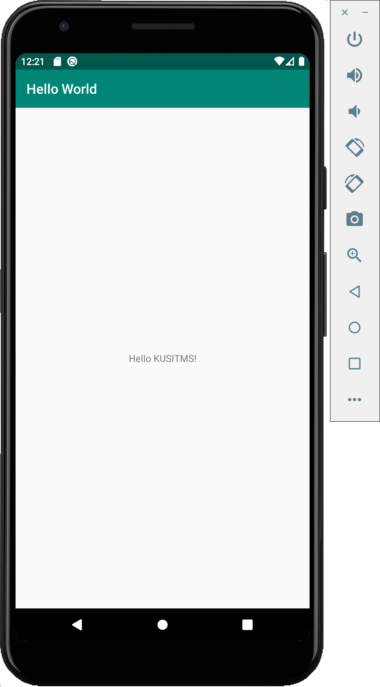

# 1주차 과제
복습을 위해서, 앞으로 매주 간단한 과제가 나갈 예정입니다. 심심할 때 한번씩 해보세요! 제출은 저에게 갠톡으로 하시면 됩니다 ㅎㅎ 안하셔도 벌금은 없는데, 하시면 피드백 해드리겠습니다.

## Hello world! 복습
저번 시간, 안드로이드 스튜디오 셋팅을 완료했죠? 에뮬레이터 위에 우리의 앱을 돌려보려고 했는데, 시간이 안돼서 못하신 분들이 많았습니다.

과제로 다음과 같이 "Hello KUSITMS!" 이라고 적혀있는 앱을 띄워보도록 합시다.



## git 복습
이제 코드를 변경했으니, 변경사항을 저장해서 올려야겠죠? git을 실행하여 다음을 따라해봅시다.

#으로 시작하는건 제가 코멘트를 남기는 것이니, 실제로 실행할 때는 무시하셔도 됩니다.

```bash
# 변경된 파일들이 나열됨
git status

# 변경된 파일들을 commit하기 위한 stage area로 올림
git add *   # 특정한 파일만 stage하고싶다면, git add {{ 특정파일 }} 을 실행시키면 됨

# stage area에 있는 파일들을 commit하여 저장함.
git commit -m "Change textview content to Hello KUSITMS"

# 저장된 사항들을 원격 repository에 push!
git push
```

우리의 repository에 업데이트되었는지 확인해봅시다!

## 제출
저에게 스크린샷을 찍어 인증해주세요~ 질문 있으시면 언제나 물어보세요! 스터디방이든 갠톡이든 상관 없습니다.