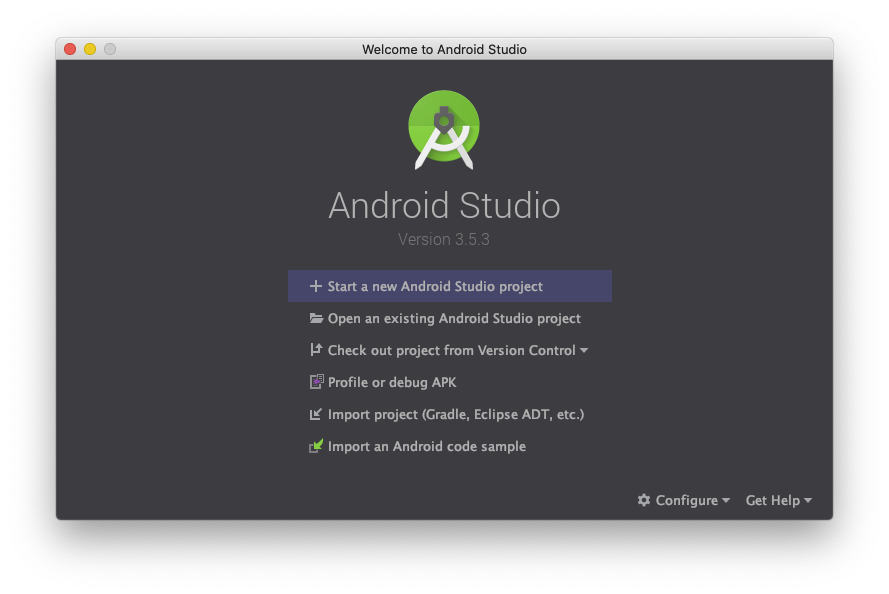
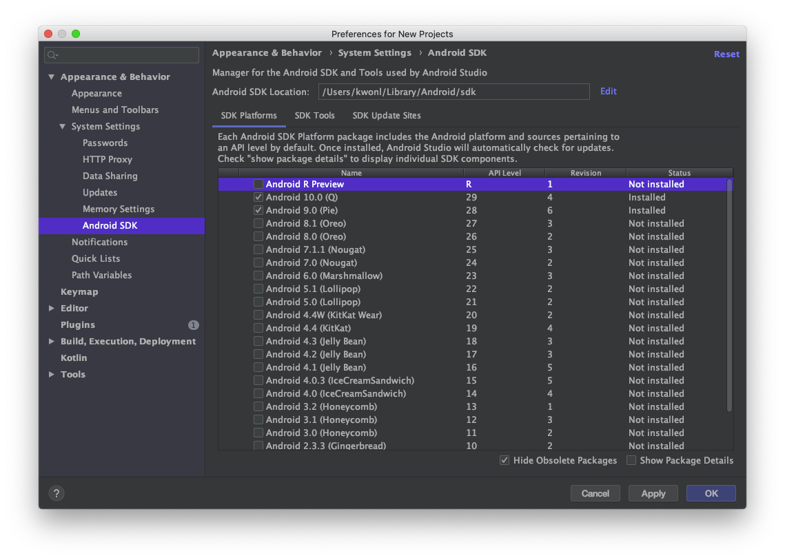
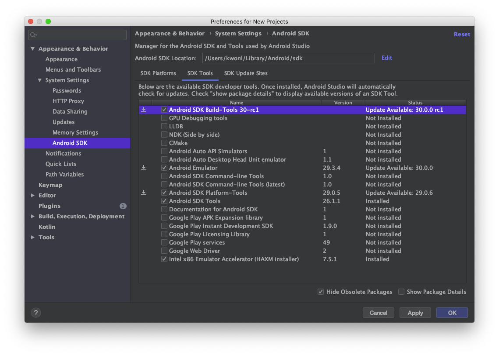
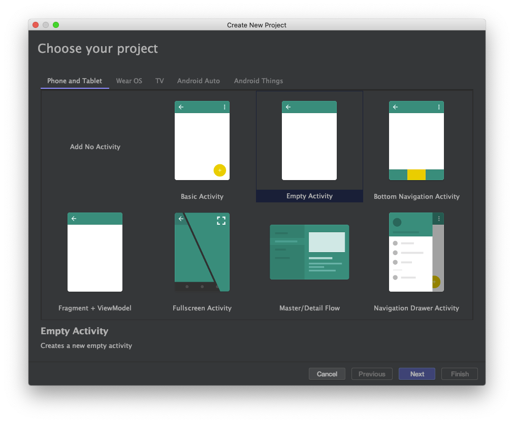
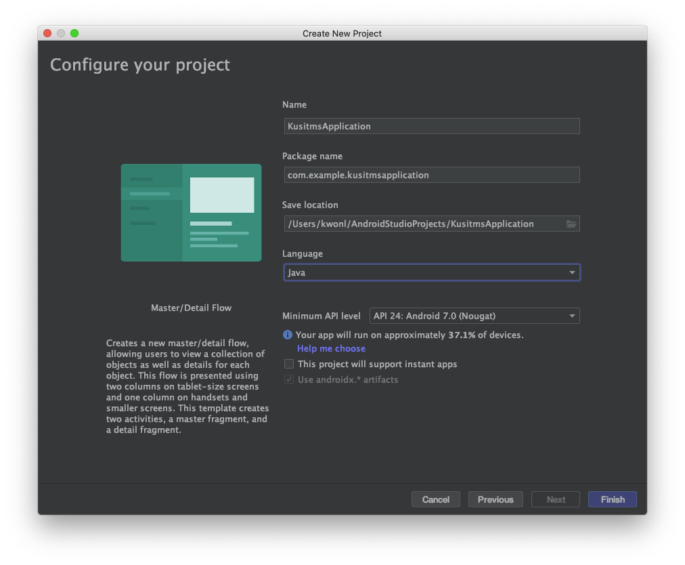
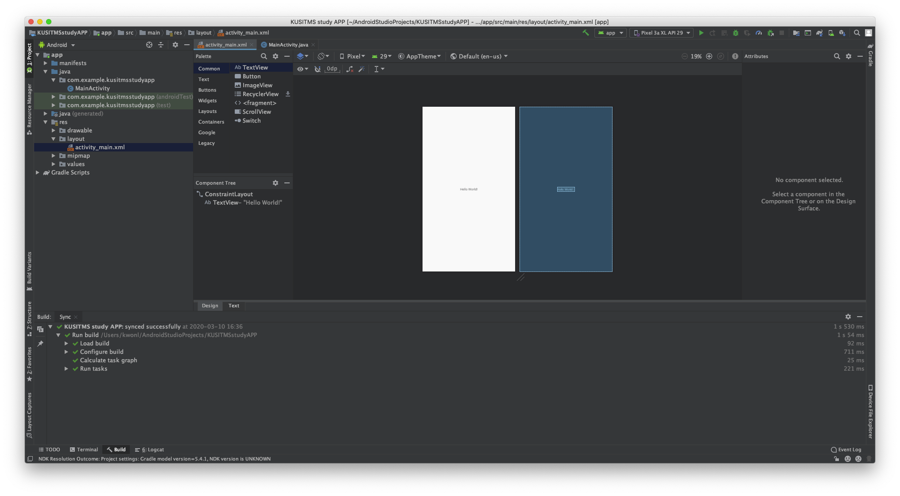
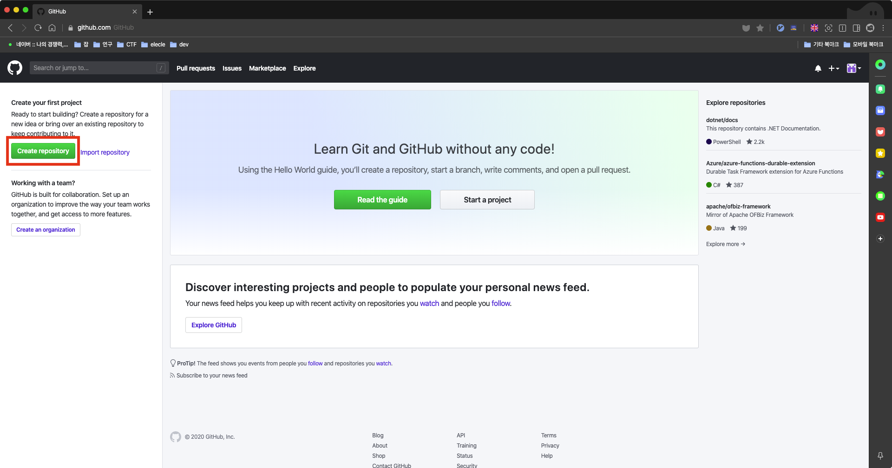
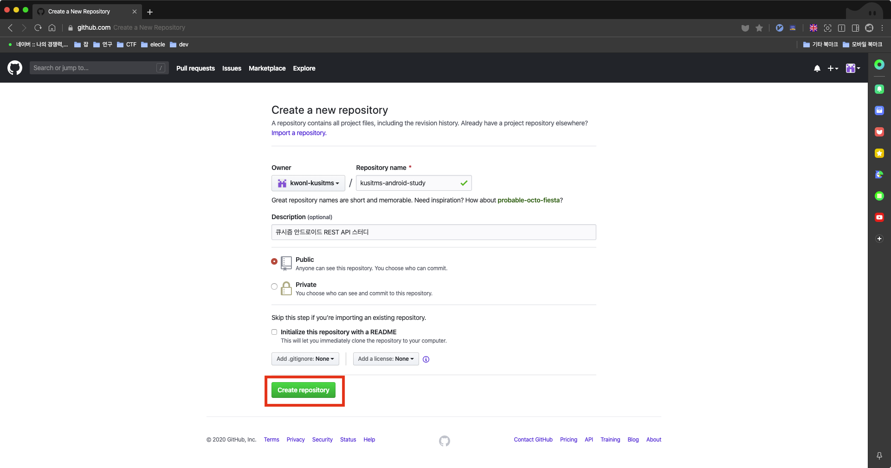
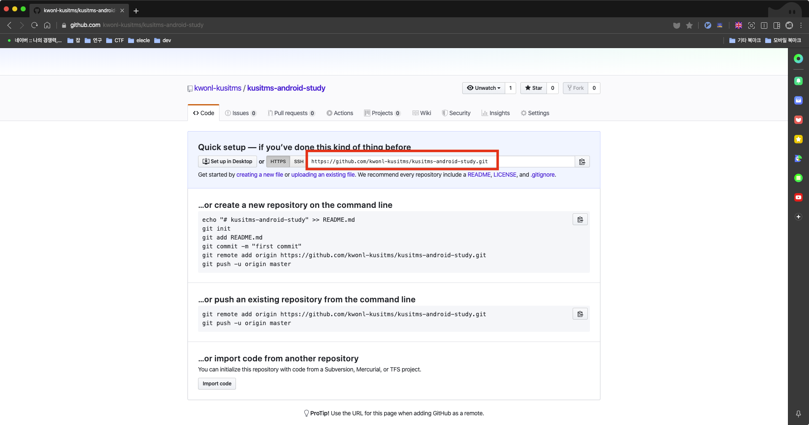
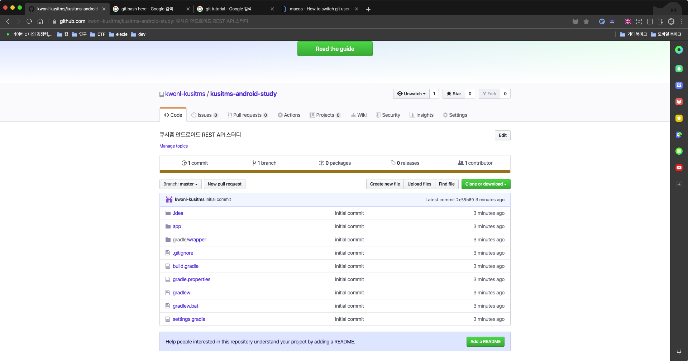

# 안드로이드 - REST API 스터디 1주차
## 안드로이드
### 안드로이드 스튜디오 설치
다음 링크에 설치 가이드가 잘 나와있습니다. OS별로 가이드를 따라 잘 설치해주세요!

> [https://developer.android.com/studio/install?hl=ko](https://developer.android.com/studio/install?hl=ko)

## Settings
설치를 한 뒤 안드로이드 스튜디오를 실행시키면, 다음과 같은 화면이 나옵니다.



여기서 `Configure > SDK Manager`를 눌러주세요.



SDK Platforms를 선택한 뒤, 그림과는 다르게.. Android 7.0(Nougat)을 체크해줍니다.



SDK Tools를 선택한 뒤, 체크를 다음과 같이 해주시고, Apply를 누르시면 설치가 시작됩니다!

다 되면, OK를 누르시고 다시 돌아와주세요

### Hello World!
설치를 마치고, 초기 셋팅을 하셨으면 우리의 첫번째 프로젝트를 만들어보도록 합시다!

아까 시작화면에서, `Start a new Android Studio project`를 클릭!



다음과 같이 Empty Activity를 클릭하고 Next를 눌러줍시다



앱의 이름을 정하고(영어만 가능), Package name과 Save location은 자동으로 생성되도록 합시다. 유의해야 할 점이 있습니다!

1. API level은 안드로이드의 버전을 설정해주는 것이라 생각하면 편합니다. 저는 24로 설정하겠습니다.
2. Language는 Java로!!

Finish를 눌러 프로젝트를 생성해줍니다. 프로젝트 초기 셋팅이 굉장히 오래 걸리므로, 기다려주세요..



프로젝트의 왼쪽에 탐색기가 보이시죠? **res/layout/activity_main.xml**을 클릭하시면 다음과 같이 메인화면을 디자인 할 수 있도록 나옵니다! 이제 상단의 초록색 화살표를 눌러 에뮬레이터를 구동해봅시다! 이 때, 에뮬레이터 선택 및 설치 등의 과정이 있는데, 자세한건 다음 링크에서 봐주세요! 

> [에뮬레이터 설치 및 구동](https://developer.android.com/studio/run/emulator?hl=ko#runningapp)

## Git
### git이란?
git은 개발자의 필수 도구입니다. 21세기 가장 위대한 발명은 docker, git이라는 말이 있습니다(뇌피셜). git은 한마디로, **버전 관리 시스템** 입니다. 이것이 무엇인지는 다음의 예시를 보시면 이해가 되실 겁니다.

1. 여러분은 과제를 제출하기 위해 레포트를 작성중입니다. 3시간 째 최종본을 수정하고 있습니다. 그리고 새로 수정할 때마다, 파일 뒤에는 이상한 이름이 붙게 되죠. 레포트-최종본.docx, 레포트-최최종본.docx, 레포트-최최최종본.docx, 레포트-진짜마지막final.docx... 이런 것을 방지하기 위해, 파일이 변할 때마다 스냅샷을 찍어 자동으로 관리해줄 수 있으면 얼마나 좋을까요? git은 이렇듯 각 파일의 버전을 관리할 수 있습니다. 단 몇 번의 명령어만으로 위와 같은 일을 없애주죠!
2. 팀플을 하던 중, 레포트를 각자 작성하여 합치도록 결정하였습니다. 그런데 합치는 과정이 너무 번거롭네요! 그리고 하나의 레포트를 여러 사람이 수정하다보니, 동시에 수정한 부분이 있어 레포트가 꼬이게 됩니다. 개발에서도 협업을 진행하다 보면 이런 현상이 발생하는데, 이것을 git에서는 branch라는 시스템으로 훌륭하게 해결해냅니다!

### git 설치
- 윈도우: 다음의 링크를 이용 [https://wonderbout.tistory.com/64](https://wonderbout.tistory.com/64)
- Mac, Linux: 이미 설치되어 있을 겁니다. 터미널을 열어 `git --version`을 실행.

## Github
우리는 개발을 할 때, 반드시 다른 사람과 협업을 하게 됩니다. 그렇게 되면 우리의 프로젝트를 다른사람들과 공유할 수 있는 서비스가 있어야겠죠? Github는 우리가 만든 git 프로젝트를 클라우드에 저장할 수 있도록 해주는 웹 서비스입니다. 흔히들 Github를 잘 꾸미면 포트폴리오를 만들 필요가 없다고 하죠? 그래서 다들 Github가 포트폴리오 사이트인줄 아는데, 회사에서는 협업을 위해 사용합니다. 대부분 private repository를 사용해서 어차피 포트폴리오로는 사용 못해요.. 흑

아무튼 우리는 개발 전반을 배우는 것도 목적이므로, Github에 레포를 만들어서 사용해봅시다!

### 프로젝트 만들기
[https://github.com](https://github.com) 에 접속하여 Sign Up을 클릭해준 뒤, 정보를 입력하여 가입해줍니다.



이후 이메일 인증과 로그인을 마치면, 다음과 같은 창에서 repository를 만들어줍시다! repository는 우리의 프로젝트를 저장하는 단위라고 생각하면 됩니다.



위 그림과 같이 정보를 입력해주고, 레포지토리를 생성해줍니다.



이제 우리는 우리의 프로젝트를 github에 올릴 준비가 되었습니다! 빨간색 박스 안의 URL을 복사해줍시다.

## git 프로젝트 만들기
이제 우리의 프로젝트를 git에 올릴 차례입니다! 각 플랫폼별로 다음과 같이 명령어를 실행해주세요!

### Windows
1. 우리가 만든 안드로이드 프로젝트 폴더로 들어간다.
2. 폴더의 배경에 우클릭을 하고, **Git Bash Here** 이라는 문구를 클릭한다.
3. 다음과 같이 터미널이 실행된다. 그리고 다음의 명령어들을 입력해 준다.
   
    ```bash
    git config --global user.name "내가 정한 이름"
    git config --global user.email "내가 입력한 이메일"
    ```
    위 명령어는 git의 초기 설정을 하는 것입니다. 각가 github에 가입할 때 사용한 이름과 이메일을 입력하면 됩니다!!

    ```bash
    git init
    git add ./\*
    git commit -m "initial commit"
    ```

    위 command들은 1. git 프로젝트를 초기화하고, 2. 파일들을 추가해준 뒤, 3. commit을 통해 파일들을 저장하는 것이다. git에 대한 자세한 tutorial은 자료를 드릴테니, 참고해주세요!

    ```bash
    git remote add origin "아까 복사한 url"
    git push --set-upstream origin master
    ```

    위 command를 통해, 우리가 Github에 만들었던 repository를 우리 프로젝트에 설정해주고, 변경사항을 클라우드에 저장한 것입니다. 다음부터는 변경 commit이 있을 때, 다음과 같이 입력해주면 변경사항을 푸쉬할 수 있습니다.

    ```bash
    git push
    ```

### Mac | Linux
1. 터미널을 실행한다.
2. cd와 ls를 통해 안드로이드 프로젝트로 들어간다.
3. 이후는 윈도우와 동일

## Finally



완성!!

## 마치며
오늘은 1주차니까 간단히 했습니다. 다음시간부터는 본격적으로 안드로이드 프로그래밍을 해봅시다!