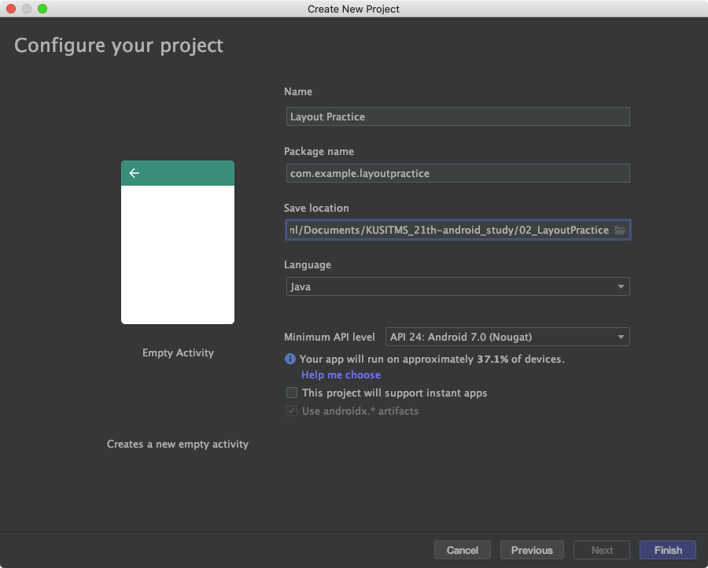
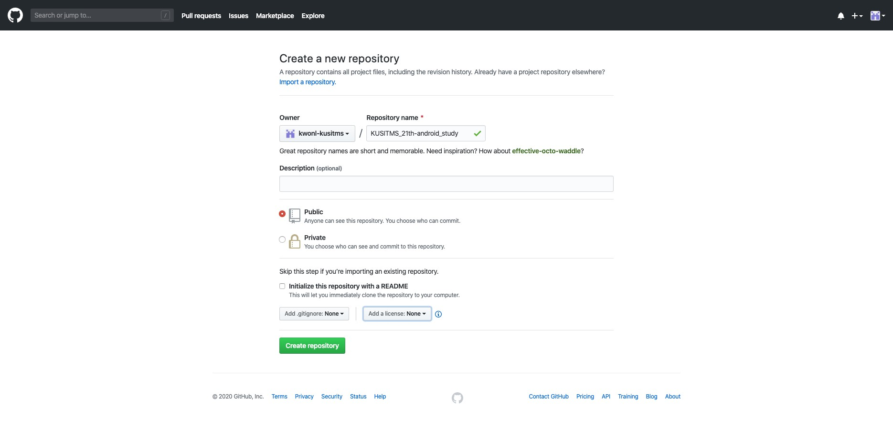
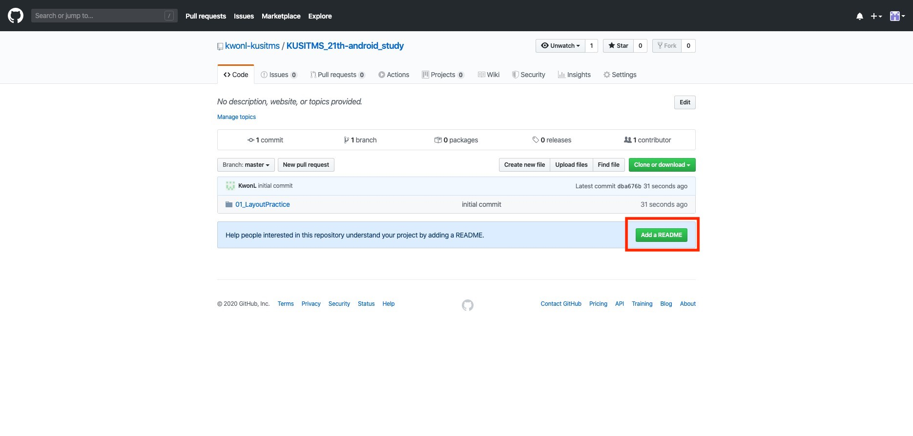
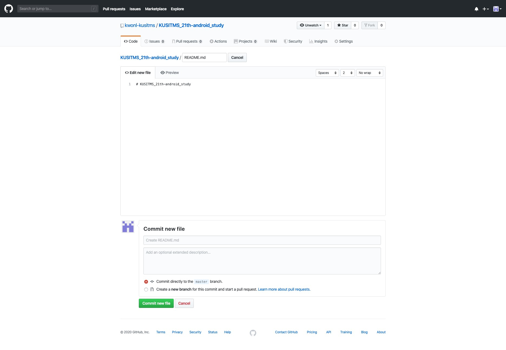
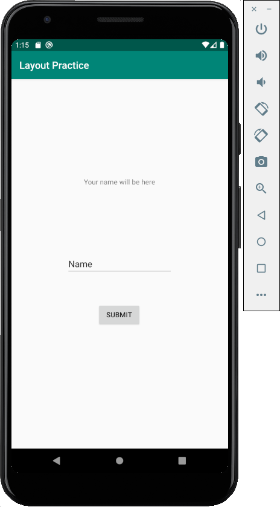
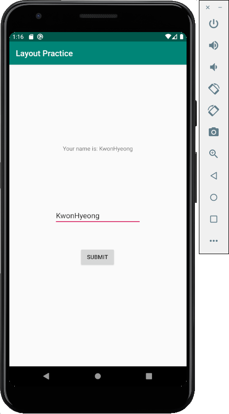
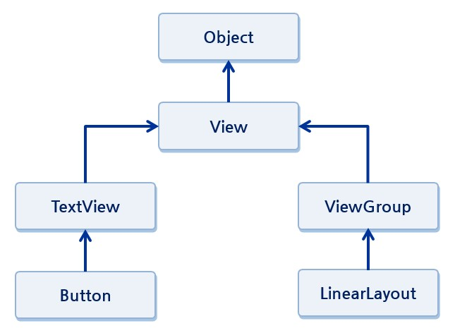

# 안드로이드 - REST API 스터디 2주차
이번 주에는 안드로이드의 view와 layout, fragment에 대해 배워봅시다.

## 복습
들어가기 전에, 저번 시간에 했던 것을 복습해보면서 제대로 된 project setting을 해봅시다. 우리는 앞으로 새로운 것을 만들 때마다 새로운 안드로이드 프로젝트를 만들 건데, 이것을 하나의 git repository에 저장해둡시다.

이름이 **KUSITMS_21th-android_study** 폴더를 만들어 줍시다. 위치는 어디든 상관 없습니다. 저는 **/Users/kwonl/Documents**에 만들겠습니다! 앞으로 만들 안드로이드 프로젝트들은 위치를 이곳으로 지정해주세요!

### 안드로이드
다음과 같이 프로젝트를 생성해줍시다. 필요한 것은 이전 시간에 다 깔아놨으니, 초기 빌드가 오래걸리지는 않을 거에요!



### git
다음은 우리의 git project를 셋팅해줘야겠죠? 다음과 같이 **KUSITMS_21th-android_study** 라는 이름의 repository를 생성해줍시다.



됐으면 이제, **KUSITMS_21th-android_study**를 만든 위치로 가서 git bash를 실행해주세요! 윈도우의 경우, 우클릭 후 git bash here를 실행하시면 됩니다.

이제 다음의 command를 통해 첫 commit을 작성하고 push를 해줍시다.

```bash
# {{ 변수 }} 이렇게 것은, {{ 변수 }} 대신에 변수를 입력하라는 뜻입니다!
git init
git remote add origin "{{ github repository URL }}"
git add *   # Add all unstaged files. *은 wildcard라고 해서, 모든 파일을 의미합니다(숨김 파일 제외)
git commit -m "initial commit"
git push --set-upstream origin master   # Upstream, 즉 지금 branch의 remote branch를 설정하라는 의미로, 다음부터는 그냥 git push만 실행해도 됩니다.
```



프로젝트가 위와 같이 설정되었는데, 잘 보면 README를 추가하라고 나와있죠? README.md는 markdown이라는 언어(언어? 음 html?)로 작성된 문서를 말하는데, 작성이 쉽고 간결해서 문서를 코딩 관련 문서를 작성할 때 많이 사용됩니다. README.md는 프로젝트의 설명을 쓰는 문서라고 생각합시다. 빨간 버튼을 눌러봅시다!



일단 위와 같이 나오는데, # 은 제목을 설정하는 것입니다. README.md를 만들어줍시다.

그런데, remote repository(원격 저장소)에서 변경된 내용이 생겼는데, 우리의 local repository는 이걸 모르죠? 따라서 이걸 업데이트하는 과정을 거쳐야 합니다. 다음의 command를 입력하세요!

```bash
# git에서는 원격으로 업데이트하는 것을 push, 원격을 로컬로 가져오는 것을 pull이라 합니다.
git pull origin master
```

그러면 우리의 local repository에 README.md 가 추가된 것을 확인할 수 있습니다. 와우!

## 프론트엔드와 백엔드
이전에 말했 듯이, 안드로이드 앱은 할 때는 프론트와 백엔드를 나눌 수 있습니다. 프론트는 사용자의 화면에 비춰지는 부분을 구성하는 것이고, 백엔드는 뒤에서의 동작을 바꾸는가 것을 구성하는 것이죠. 예를 들어보면 편하죠. 다음과 같은 앱이 있다고 생각해봅시다.



위 앱은 Name이라는 곳에 우리의 이름을 입력하고 버튼을 클릭하면 다음과 같이 이름을 출력해주는 간단한 앱입니다. 다음과 같이요!



정말 간단하죠? 이때, 우리가 보는화면..즉, 버튼이나 텍스트 등을 구성하는 코드가 프론트엔드입니다. 그리고 버튼을 누르면 이름을 가져와서 위에다가 셋팅해주는 과정을 해주는 것이 백엔드이죠!

프론트엔드는 xml 코드로 이뤄져있으며, 백엔드는 java로 이뤄져 있습니다. 각각의 코드를 보면 다음과 같습니다.


```xml
<!--위 화면의 frontend-->
<?xml version="1.0" encoding="utf-8"?>
<androidx.constraintlayout.widget.ConstraintLayout xmlns:android="http://schemas.android.com/apk/res/android"
    xmlns:app="http://schemas.android.com/apk/res-auto"
    xmlns:tools="http://schemas.android.com/tools"
    android:layout_width="match_parent"
    android:layout_height="match_parent"
    tools:context=".MainActivity" >

    <EditText
        android:id="@+id/nameInput"
        android:layout_width="wrap_content"
        android:layout_height="wrap_content"
        android:ems="10"
        android:inputType="textPersonName"
        android:text="Name"
        app:layout_constraintBottom_toBottomOf="parent"
        app:layout_constraintEnd_toEndOf="parent"
        app:layout_constraintStart_toStartOf="parent"
        app:layout_constraintTop_toTopOf="parent" />

    <Button
        android:id="@+id/submitButton"
        android:layout_width="wrap_content"
        android:layout_height="wrap_content"
        android:text="Submit"
        app:layout_constraintBottom_toBottomOf="parent"
        app:layout_constraintEnd_toEndOf="parent"
        app:layout_constraintHorizontal_bias="0.498"
        app:layout_constraintStart_toStartOf="parent"
        app:layout_constraintTop_toBottomOf="@+id/nameInput"
        app:layout_constraintVertical_bias="0.183" />

    <TextView
        android:id="@+id/textView"
        android:layout_width="wrap_content"
        android:layout_height="wrap_content"
        android:layout_marginTop="64dp"
        android:text="Your name will be here"
        app:layout_constraintBottom_toTopOf="@+id/nameInput"
        app:layout_constraintEnd_toEndOf="parent"
        app:layout_constraintStart_toStartOf="parent"
        app:layout_constraintTop_toTopOf="parent" />
</androidx.constraintlayout.widget.ConstraintLayout>
```

```java
/* 위 화면의 backend */

package com.example.layoutpractice;

import androidx.appcompat.app.AppCompatActivity;

import android.os.Bundle;
import android.view.View;
import android.widget.Button;
import android.widget.EditText;
import android.widget.TextView;

public class MainActivity extends AppCompatActivity {

    @Override
    protected void onCreate(Bundle savedInstanceState) {
        super.onCreate(savedInstanceState);
        setContentView(R.layout.activity_main);

        Button submitButton = findViewById(R.id.submitButton);
        submitButton.setOnClickListener(new Button.OnClickListener() {
            @Override
            public void onClick(View view) {
                EditText nameInput = findViewById(R.id.nameInput);
                String name = nameInput.getText().toString();

                TextView textView = findViewById(R.id.textView);
                textView.setText("Your name is: " + name);
            }
        });
    }
}
```

우리는 오늘 frontend를 마스터(?) 해볼 겁니다!!

## View
안드로이드의 프론트엔드는 view로 이루어져 있습니다. view란 무엇인가? 안드로이드의 화면을 구성하는 기본 component라고 생각하시면 편합니다! 예를 들어 HTML을 생각해보면, HTML에는 여러가지 태그가 있고, 이 태그가 구성되어 화면을 이루게 되죠? 안드로이드에서도 똑같이, 여러 종류의 view가 있고 이것들이 모여서 화면을 구성하게 됩니다. 다음 그림을 보시면 이해가 편합니다.


> 출처: 네이버 부스트코스 안드로이드 강좌

기본적으로 View는 내부에 View를 포함할 수 있습니다. 이렇게 View가 모이게 된 것을 ViewGroup이라고 하고, Layout을 통해 View를 배치할 수도 있죠. OOP를 배워보신 분이라면 상속이라는 개념에 익숙하실텐데, 우리가 사용하는 View에는 여러가지 종류가 있지만, Layout, ViewGroup 등도 View를 상속하게 됩니다. 간단히 말해서, HTML의 태그와 같다고 생각하시면 돼요! HTML에서도 `div` 태그 안에 여러가지 태그가 포함될 수 있고, `p`태그 안에도 다른 태그가 포함될 수 있고.. xml 코드로 보시면 view의 크기는 `_width`, `_height`로 정의됨을 알 수 있습니다.


## Layout
Layout에 따라서 그 안의 view가 어떻게 배치되는지 결정이 됩니다. 따라서 상황에 따른 Layout을 적절히 사용하는 것이 중요하겠죠? 한번 알아보도록 합시다!

### Constraint Layout
우리가 기본적으로 Hello world project를 만들면 생성되는 layout입니다. constraint layout은 제약선(constraint)를 이용하여 view의 배치를 결정합니다. 참 쉽죠? constraint는 상하좌우 4방향으로 뻗어있으며, 반드시 4방향이 모두 연결되어 있어야 합니다. 그래야 view의 위치를 잡을 수 있기 때문이죠!

그리고 각각의 constraint는 다른 view에 붙어서 자신의 위치를 결정합니다. 이 때 다른 view는 parent(자신을 감싸고 있는 view)일 수도 있고, 근처에 위치한 다른 sibling view일 수도 있습니다.

위의 예제를 보면, nameInput view는 parent(Layout)에 붙어있고, bias도 모두 0이며 constraint 길이도 0이기 때문에 가운데로 고정이 되겠죠? 즉, constraint layout에서는 view의 위치를 결정짓는 것이 constraint의 길이와 bias 두 가지입니다. 보통은 디자이너가 px단위로 작업해서 넘어주기 때문에, bias보다는 constraint의 길이를 통해 결정짓는 것같기는 합니다.

### Linear Layout