# 안드로이드 - REST API 스터디 3주차
이번주에는 안드로이드에서의 backend에 입문해봅시다. Evenet listener와 intent, ListView 등에 대해서 다뤄봅시다! 이제부터는 본격적으로 Java코딩을 해야합니다. 하지만 제가 누누히 말씀드리지만, Android에서 Java코딩은 그렇게 어렵지 않(을수도 있)기 때문에 금방 익숙해지실 겁니다!

## Event
### Thread, Asynchronous Task와 Event 이해하기
먼저, Android의 event를 보기 전에 다음과 같은 코드를 보겠습니다.

```c
#include <stdio.h>

int main() {
    printf("hello world!\n");
    for (int i = 0; i < 10; i++) {
        printf("%d\n", i);
    }
}
```

우리는 C정도는 할줄 알기 때문에 위의 간단한 코드를 이해할 수 있겠죠? hello world를 출력하고, 0부터 9까지의 숫자를 출력하는 아주 간단한 프로그램입니다. 그런데, 우리가 사용자의 입력을 기다려야한다면 어떻게 될까요? 사용자가 입력한 숫자까지 출력하는 프로그램을 짜보도록 하면 다음과 같습니다.

```c
#include <stdio.h>

int main() {
    int input;

    printf("hello world!\n");
    scanf("%d", &input);

    for (int i = 0; i < input; i++) {
        printf("%d", i);
    }

    // 굉장히 복잡하고 오래 걸리는 task
}
```

이 프로그램도 간단하죠? 위 프로그램은 사용자가 숫자를 입력할 때까지 기다린 뒤 입력값을 바탕으로 이후의 동작을 결정합니다. 이렇듯 프로그램은 사용자의 입력값에 따라 다양하게 동작하도록 설계되어 있습니다.

그런데, 사용자의 입력값을 기다리지 않고 계속해서 프로그램을 실행시켜야 한다면 어떨까요? 예를 들면 안드로이드에서는 사용자의 입력값이 '터치하는 것' 이라고 할 때, 사용자가 터치할 때까지 프로그램이 멈춰있으면 안되겠죠?

이런 맥락에서 나온 개념이 바로 **Asynchronous programming**입니다. 비동기 프로그래밍이라고 하죠? 즉, 프로그램을 실행하는 Main thread가 있고, 다른 thread가 event를 기다리며 event가 발생하면 main thread에 알려주어 이것을 프로그램에 반영하는 것이죠.

이것도 예시를 들어 설명해보죠!

#### Async taks 예시
여러분은 회사에서 일을 하고있습니다. 부장님이 갑자기 일을 주시네요. 그런데 부장님이 제가 일을 다 끝마칠 때까지 본인은 일을 안하고 놀고 있는다고 합니다. 부장님은 다른 처리할 일이 있음에도 불구하고요!! 말도안되는 비효율이죠? 이 때, 효율적으로 일을 처리하려면 어떻게 해야할까요?

답은 간단하죠. 부장님이 여러분에게 일을 주고, 본인의 일을 처리하시면 됩니다. 그러면 여러분이 일을 처리하는 동안에도 부장님은 놀지 않고, 일이 훨씬 효율적으로 이뤄질 수 있겠죠?

위의 프로그래밍 예시에서도 똑같습니다. 사용자의 입력값을 기다리면서 뒤에 굉장히 복잡하고 오래 걸리는 task를 막고 있는것보다(이것을 blocked 되었다고 표현합니다), 사용자의 입력값은 다른 친구(thread)에게 기다리게 하고 부장님(Main thread)는 뒤의 일을 처리하는 것이 효율적이겠죠?

#### 그래서 Android에서 이게 어떻게 쓰이는데?
이제 Android 프로그래밍에 이것을 적용시켜봅시다. 안드로이드는 main thread와 여러 다른 thread(일꾼들)을 가집니다. 대부분의 중요한 것은 main thread에서 담당하죠. 위에서 말했듯, '터치하는' 입력값을 계속해서 기다리고, 터치할 때마다 화면이 바뀌도록 하면 굉장히 부자연스럽겠죠? 그러므로 main thread는 터치와는 상관 없이 계속해서 돌아가야 합니다(block되지 않고).

따라서 main thread는 다른 thread(일꾼)에게 사용자의 입력값(event)를 담당하도록 맡겨두고, 사용자의 입력값에 따라 무엇을 할지 미리 정해둡니다. 다른 thread에서는 이러한 행위를 event를 listen한다고 합니다.

#### 결론
장황하게 말했지만, 결국 말하고자 하는 것은 다음 그림과 같습니다.

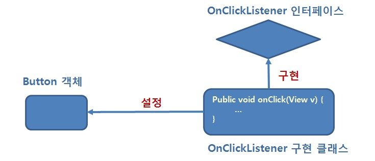

즉, OnClickListener(클릭 시 어떤 코드를 실행할 것인지 규정)를 설정해서, Button이 클릭되었을 때 미리 짜여진 코드를 실행시키는 것입니다. 정말 쉽죠?

### 실습해보기
안드로이드에서 가장 기본적인 Event는 역시 touch event이죠? 이것에 대해 실습을 해봅시다.

```java
/* MainActivity.java */

@Override
protected void onCreate(Bundle savedInstanceState) {
    super.onCreate(savedInstanceState);
    setContentView(R.layout.activity_main);

    TextView textView = findViewById(R.id.textView);
    textView.setOnTouchListener(new View.OnTouchListener() {
        @Override
        public boolean onTouch(View view, MotionEvent motionEvent) {
            int action = motionEvent.getAction();

            if (action == MotionEvent.ACTION_DOWN) {
                Log.d("study", "onTouch: down");
            } else if (action == MotionEvent.ACTION_MOVE) {
                Log.d("study", "onTouch: move");
            } else if (action == MotionEvent.ACTION_UP) {
                Log.d("study", "onTouch: up");
            }

            return true;
        }
    });
}
```

`MainActivity.java`에서, onCreate를 다음과 같이 작성해봅시다. onCreate란, Activity(화면)이 만들어졌을 때 어떤 코드를 실행할 지 설정하는 것이라고 생각하면 됩니다.

`Log.d()`라는 함수가 있죠? 해당 함수는 디버깅에 사용되는 것인데, 말 그대로 logging을 하는 함수입니다. 디버깅에서 가장 중요한 건 변수를 print해보거나 control flow에서 print를 끼워넣어보는 것입니다. 이 함수를 통해서 우리는 출력을 볼 수 있습니다. 다음과 같이 Logcat이라는 곳에서요!! 여기에는 굉장히 많은 로그들이 나오는데, 검색을 통해 우리가 원하는 log를 볼 수 있습니다. 각 log는 검색이 용이하도록 tag를 가지는데, 이것은 임의로 설정할 수 있습니다.

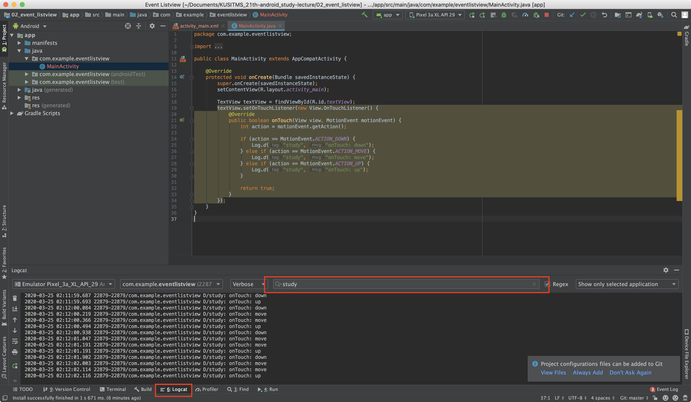

**textView**라는 view를 찾아서, 해당 view를 눌렀을 때 어떤 행동을 할 지 listener를 설정해주는 것이라 보면 되겠죠? `OnTouchListener` 클래스의 인스턴스를 만들어서, 즉시 `onTouch`라는 함수를 override합니다. 이해가 잘 되지 않으신다면 OOP의 class 개념을 배우면 편합니다! 그런데 지금은 딱히 이해할 필요는 없습니다. 자세한건 다음 페이지를 참고해주세요 ㅎㅎ 잘 정리가 되어 있습니다. 클래스의 상속까지만 알면 됩니다.

> [https://wikidocs.net/218](https://wikidocs.net/218)

`onTouch`라는 친구는 touch가 발생했을 때, 해당 touch가 발생한 view와 어떤 event를 받았는지를 argument로 받아 작동합니다. 이 event 종류는 Integer형인데, 미리 정의된 android의 상수로 표현 됩니다. 해당 함수 안에서 event의 종류를 판별하여 각 event마다 어떤 동작을 할 지 코드를 작성할 수 있겠죠?!

### OnClickListener
여러분이 가장 많이 사용할 listener입니다. 제가 앞선 시간에 말했죠? 우리가 만들 앱은 대부분 TextView, EditText, Button, ImageView 등으로 해결할 수 있다고! 이 listener는 Button에 주로 사용되는 listener로, 이름으로부터 짐작할 수 있듯 버튼을 클릭했을 때 동작을 정의합니다. 대략적인 문법은 다음과 같습니다.

```java
/* MainActivity.java */

@Override
protected void onCreate(Bundle savedInstanceState) {
    super.onCreate(savedInstanceState);
    setContentView(R.layout.activity_main);

    Button button = findViewById(R.id.button);
    button.setOnClickListener(new View.OnClickListener() {
        @Override
        public void onClick(View v) {
            // Your code will be here.
        }
    });
}
```

이건 많이 본 코드죠? 넘어가도록 합시다.

## Toast와 AlertDialog
### Toast
toast는 다음과 같은 것을 말합니다. 아마 많이 보셨을텐데요! 이러한 toast 메시지는 아주 간단히 만들 수 있습니다.

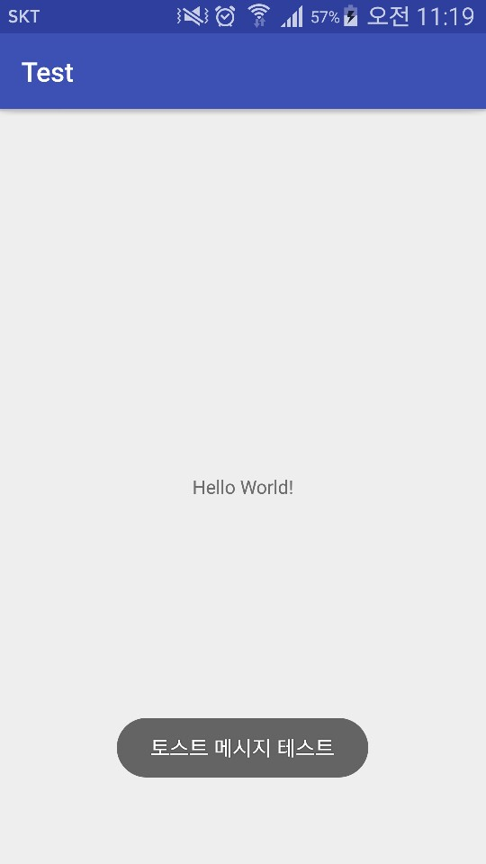

보통은 에러메시지를 표시해주거나, 사용자에게 짧게 알림을 주고싶을 때 사용합니다. 다음과 같이 한번 사용해보죠!

```xml
<!-- activity_main.xml -->

<?xml version="1.0" encoding="utf-8"?>
<androidx.constraintlayout.widget.ConstraintLayout xmlns:android="http://schemas.android.com/apk/res/android"
    xmlns:app="http://schemas.android.com/apk/res-auto"
    xmlns:tools="http://schemas.android.com/tools"
    android:layout_width="match_parent"
    android:layout_height="match_parent"
    tools:context=".MainActivity">

    <Button
        android:id="@+id/button"
        android:layout_width="wrap_content"
        android:layout_height="wrap_content"
        android:text="Button"
        app:layout_constraintBottom_toBottomOf="parent"
        app:layout_constraintEnd_toEndOf="parent"
        app:layout_constraintStart_toStartOf="parent"
        app:layout_constraintTop_toTopOf="parent" />
</androidx.constraintlayout.widget.ConstraintLayout>
```

```java
/* MainActivity.java */
public class MainActivity extends AppCompatActivity {

    @Override
    protected void onCreate(Bundle savedInstanceState) {
        super.onCreate(savedInstanceState);
        setContentView(R.layout.activity_main);

        Button button = findViewById(R.id.button);
        button.setOnClickListener(new View.OnClickListener() {
            @Override
            public void onClick(View v) {
                Toast toast = Toast.makeText(getApplicationContext(), "토스트 테스팅입니다.", Toast.LENGTH_SHORT);
                toast.show();
            }
        });
    }
}
```

위와 같이 아주 간단하게 Toast를 만들 수 있습니다. getApplicationContext는..context에 대해서는 다음에 설명하도록 하겠습니다(저도 잘 모르긴 해요 ㅎ). 그냥 사용법이 저렇다 생각하시면 될 것 같습니다!

### Snackbar
스낵바는 토스트와 비슷한데, 아래에 잠시 올라왔다가 내려가는 메시지 창입니다. 사용법은 toast와 비슷합니다.

```java
/* MainActivity.java */

public class MainActivity extends AppCompatActivity {

    @Override
    protected void onCreate(Bundle savedInstanceState) {
        super.onCreate(savedInstanceState);
        setContentView(R.layout.activity_main);

        Button button = findViewById(R.id.button);
        button.setOnClickListener(new View.OnClickListener() {
            @Override
            public void onClick(View v) {
                Snackbar.make(v, "스낵바 테스트", Snackbar.LENGTH_LONG).show();
            }
        });
    }
}
```

결과는 다음과 같습니다.

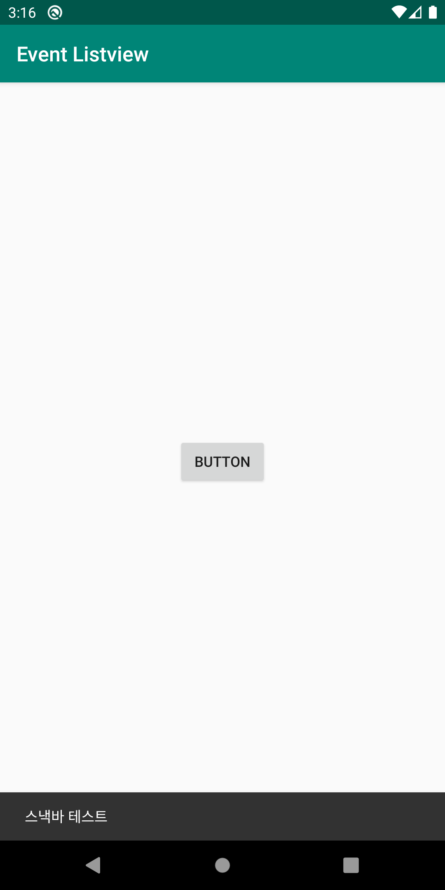

### AlertDialog
Alert Dialog는 다음과 같이 뜨는 확인 창을 의미합니다. 여러분은 많이 보셨을텐데, 주로 중요한 일을 확인할 때 사용하죠?

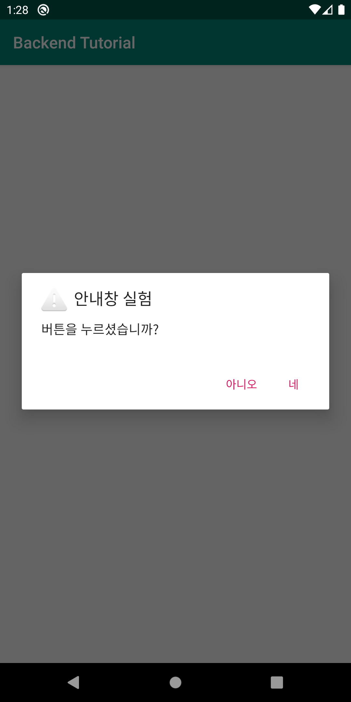

다음의 코드를 봅시다.

```java
public class MainActivity extends AppCompatActivity {

    @Override
    protected void onCreate(Bundle savedInstanceState) {
        super.onCreate(savedInstanceState);
        setContentView(R.layout.activity_main);

        Button button = findViewById(R.id.button);
        button.setOnClickListener(new View.OnClickListener() {
            @Override
            public void onClick(View view) {
                AlertDialog.Builder builder = new AlertDialog.Builder(MainActivity.this);

                builder.setTitle("안내창 실험");
                builder.setMessage("버튼을 누르셨습니까?");
                builder.setIcon(android.R.drawable.ic_dialog_alert);

                builder.setPositiveButton("네", new DialogInterface.OnClickListener() {
                    @Override
                    public void onClick(DialogInterface dialog, int which) {
                        Log.d("alertDialog", "onClick: 네!");
                    }
                });
                builder.setNegativeButton("아니오", new DialogInterface.OnClickListener() {
                    @Override
                    public void onClick(DialogInterface dialog, int which) {
                        Log.d("alertDialog", "onClick: 아니오!");
                    }
                });

                AlertDialog dialog = builder.create();
                dialog.show();
            }
        });
    }
}
```

Alert dialog는 Toast보다는 조금 더 복잡합니다. builder를 통해서 title, message 등을 setting해준 뒤 보여주도록 되어있죠. 이것도 코드를 읽어보시면서 이해하고 넘어가시면 됩니다.

## Inflate에 대한 이해
우리는 지금까지 Android의 frontend와 backend를 넘어다니면서 코딩을 하고 있습니다. frontend는 XML로, backend는 Java로 작성하고 있죠? 그런데, backend는 어떻게 frontend와 연결되고 있는 걸까요?

layout을 예시로 들어보겠습니다. activity_main.xml에서 layout을 작성하였는데, 이것을 backend에서 사용하게 되는 과정은 다음과 같았습니다.

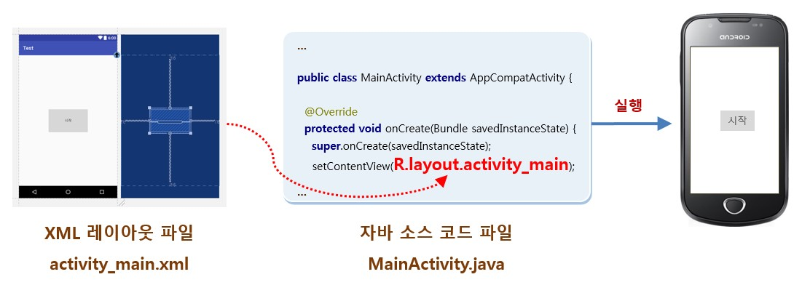
> 출처: 네이버 부스트코스 안드로이드 강좌

우리는 저번 시간에 layout을 여러개 설정하면서 실습을 해봤죠? `setContentView`라는 함수에 R.layout.activity_main을 넘겨주면(activity_main.xml을 넘겨주라는 의미겠죠?) 저 함수 내부에서 activity_main.xml에 있는 view들을 해석하고 안드로이드 내부와 우리가 짜놓은 backend에서 이러한 view들을 이용할 수 있도록 메모리에 올려줍니다. 이해가 잘 안되시면 대충..Java가 사용할 수 있는 형태로 view들을 가공해준다고 생각하시면 될 것 같습니다.

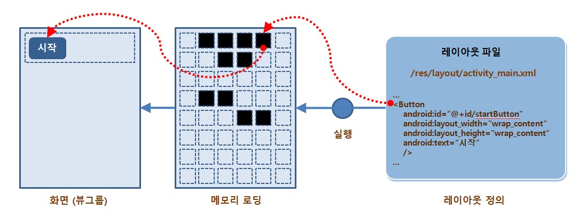

이러한 과정을 **inflate**라고 하고, 모든 view(layout을 포함하여)들은 inflate 과정을 거쳐야만 backend에서 사용되거나 화면에 나타날 수 있습니다. 예를 들어, 다음과 같은 코드도 inflate 이후에나 사용할 수 있는 것입니다.

```java
Button button = findViewById(R.id.button);
```

즉, button이라는 view가 inflation을 통해 메모리에 올라와있기 때문에 backend에서 사용하고, 안드로이드에서 이것을 이용하여 화면에 그릴 수 있는거죠.

### setContentView에서 설정하지 않은 view에 대한 inflation
그렇다면, MainActivity.java에서 activity_main.xml에 포함되지 않은 view를 사용하려면 어떻게 해야할까요? 그런 경우가 왜 발생하냐고 물어보실 수 있지만, layout을 동적으로 변경해야하는 경우는 종종 발생합니다. 예를 들면 에브리타임 앱에서, 서버로부터 게시글들을 불러오고 이것을 화면에 비춰줄 때 게시글 하나하나를 view로 생각하면 동적인 layout이 이해가 되시죠?

아무튼 이러한 경우 우리가 새로 끼워넣어줄 view가 activity_main.xml에 포함되지 않기 때문에, `setContentView`함수에서 inflation이 발생하지 않습니다. 따라서 우리가 수동으로 inflation을 해줘야 사용할 수 있게 됩니다. 다음 예시를 보시죠.

```xml
<!-- image_view.xml in layout directory -->
<?xml version="1.0" encoding="utf-8"?>
<ImageView xmlns:android="http://schemas.android.com/apk/res/android"
    android:layout_height="wrap_content"
    android:layout_width="wrap_content"
    android:src="@mipmap/ic_launcher" />
```

`layout/image_view.xml`을 만들고 다음과 같이 코드를 작성해줍시다. 그리고 우리는 코드를 통해서 동적으로 이친구를 activity_main.xml에 불러오고싶습니다. 이럴 때, 어떻게 해야할까요? 다음 코드를 봅시다!

```xml
<!-- activity_main.xml -->

<?xml version="1.0" encoding="utf-8"?>
<androidx.constraintlayout.widget.ConstraintLayout xmlns:android="http://schemas.android.com/apk/res/android"
    xmlns:app="http://schemas.android.com/apk/res-auto"
    xmlns:tools="http://schemas.android.com/tools"
    android:layout_width="match_parent"
    android:layout_height="match_parent"
    tools:context=".MainActivity">

    <LinearLayout
        android:id="@+id/linearLayout"
        android:layout_width="match_parent"
        android:layout_height="match_parent"
        android:orientation="vertical"
        app:layout_constraintEnd_toEndOf="parent"
        app:layout_constraintStart_toStartOf="parent"
        >

    </LinearLayout>
</androidx.constraintlayout.widget.ConstraintLayout>
```

```java
/* MainActivity.java */

public class MainActivity extends AppCompatActivity {

    @Override
    protected void onCreate(Bundle savedInstanceState) {
        super.onCreate(savedInstanceState);
        setContentView(R.layout.activity_main);

        LayoutInflater inflater = (LayoutInflater) getSystemService(Context.LAYOUT_INFLATER_SERVICE);
        LinearLayout linearLayout = findViewById(R.id.linearLayout);

        inflater.inflate(R.layout.image_view, linearLayout, true);
    }
}
```

`activity_main.xml`을 보면 분명히 image_view를 불러오는 부분이 없습니다. 하지만 `MainAcitity.java`에서 Activity가 만들어지자마자 inflation을 통해 image_view를 linear layout에 넣어주죠? 이렇게 함으로써 우리는 동적으로 view를 배치할 수 있게 된 것입니다. 정말 쉽죠?

inflater는 `getSystemService`라는 함수로 불러올 수 있씁니다. 그리고 inflater를 통해서 image_view라는 xml파일을 linearLayout에 추가한 것이죠. 정말 쉽죠?

## ListView
드디어 올것이 왔습니다. inflate라는 개념이 어디에 쓰일까요? 바로 이 ListView에서 많이 사용됩니다. 요즘에는 RecyclerView를 사용하지만, 일단 ListView를 배우도록 합시다 ㅎㅎ

ListView는 어디에 쓰일까요? 그리고 Lieaner layout과는 무엇이 다를까요?! 예를 들어서 봅시다. 여러분이 인스타그램이나 에브리타임 등의 앱을 써보셨으면 아시겠지만 화면에 비추어지는 내용은 동적으로 변하게 됩니다. 적절한 레이아웃의 배치가 있고, 그 내용으로 들어갈 data는 서버로부터 받아오거나 저장되어있는 것을 불러오도록 되어있죠? 게시글 하나를 받아와서 레이아웃에 채워놓도록 하려면 view가 동적으로 할당되어 바뀌어야 할 것입니다. 실습을 통해 배워보도록 하죠!

우리는 게시판을 만든다고 생각하고 실습을 해보도록 합시다. 게시판에는 게시글들이 있는데, 각 게시글을 서버로부터 불러와서 ListView에 채워놓도록 해봅시다.

### 하나의 item을 위한 layout
제가 말했듯이, ListView는 하나의 item을 위한 layout에 데이터를 채워넣어 ListView에 배치하는 것이라고 했습니다. 그러면 가장 먼저, item을 배치할 layout을 만들어야겠죠? `layout/board_item.xml`를 relative layout으로 만들고, 다음과 같이 설정해줍시다.

```xml
<!-- board_item.xml -->
<?xml version="1.0" encoding="utf-8"?>
<RelativeLayout xmlns:android="http://schemas.android.com/apk/res/android"
    android:layout_width="match_parent" android:layout_height="wrap_content">

    <TextView
        android:id="@+id/titleView"
        android:layout_width="match_parent"
        android:layout_height="wrap_content"
        android:textSize="30sp"
        android:layout_alignParentTop="true"/>

    <TextView
        android:id="@+id/contentView"
        android:layout_width="match_parent"
        android:layout_height="wrap_content"
        android:textSize="15sp"
        android:layout_below="@id/titleView"/>
</RelativeLayout>
```

위의 코드는 이해하실 수 있겠죠? 일단은 단순히 제목과 내용만 있는 layout을 만들어봤습니다. 이제 이 layout을 item으로 사용하여 채워넣을 게시판이 필요하겠죠? `activity_main.xml`에 다음과 같이 ListView를 추가해 줍시다.

```xml
<!-- activity_main.xml -->
<?xml version="1.0" encoding="utf-8"?>
<androidx.constraintlayout.widget.ConstraintLayout xmlns:android="http://schemas.android.com/apk/res/android"
    xmlns:app="http://schemas.android.com/apk/res-auto"
    xmlns:tools="http://schemas.android.com/tools"
    android:layout_width="match_parent"
    android:layout_height="match_parent"
    tools:context=".MainActivity">

    <LinearLayout
        android:id="@+id/linearLayout"
        android:layout_width="match_parent"
        android:layout_height="match_parent"
        android:orientation="vertical"
        app:layout_constraintEnd_toEndOf="parent"
        app:layout_constraintStart_toStartOf="parent"
        >

        <ListView
            android:id="@+id/boardList"
            android:layout_width="match_parent"
            android:layout_height="match_parent" />
    </LinearLayout>
</androidx.constraintlayout.widget.ConstraintLayout>
```

ListView의 id를 boarList로 지정해줍시다. 참고로 `@id`이면 id를 참조한다는 의미이고, `@+id`이면 id에 추가를 한다는 의미입니다. 이제 ListView에 내용을 채워넣어줘야 하는데, ListView는 backend에서 Adapter라는 친구를 통해 data를 채워줄 수 있습니다. 그림으로 보면 다음과 같죠!

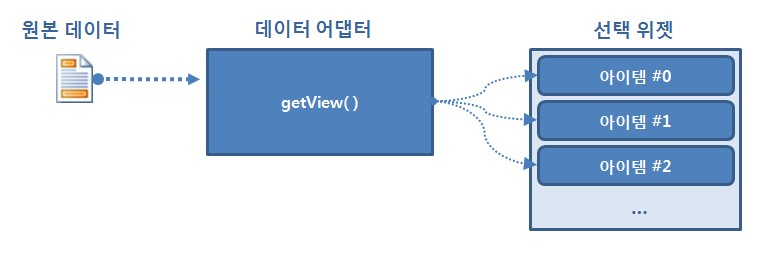
> 출처: 네이버 부스트코스 안드로이드 강좌

이 Adapter라는 친구는 getView()를 통해서 우리가 채워넣을 view(여기서는 board_item이라는 layout이겠죠?)를 얻은 뒤, 데이터를 채워넣어 ListView에 배치해주는 역할을 맡습니다. 이를 위해서 우리는 먼저 우리가 사용할 data를 class로 만들어주는 것이 좋습니다. 굳이 class가 아니어도 좋지만, 이후에 ArrayList를 사용할텐데 이 때 class를 사용해주는 것이 편합니다.

MainActivity가 위치한 폴더에 `BoardItemData`라는 class를 새로 만들어주고, 다음과 같이 코드를 써줄 수 있습니다. 이 과정에서 IDE의 여러가지 편리한 기능을 사용할 수 있는데, 스터디에서 같이 해보도록 하죠!

```java
/* BoardItemData.java */
package com.example.backendtutorial;

public class BoardItemData {
    String title;
    String content;

    public String getTitle() {
        return title;
    }

    public String getContent() {
        return content;
    }

    public BoardItemData(String title, String content) {
        this.title = title;
        this.content = content;
    }
}
```

OOP에서는 member variable에 대해서 직접 접근하지 못하도록 getter와 setter를 지정하는 것을 권장합니다. 음..encapsulation에 대해서는 나중에 알아보도록 합시다 ㅎ.

스터디를 못오시는 분들을 위해 다시 설명하자면, class를 처음에 만들고 class에 member variable까지 만들어주면, class 내부에서 우클릭에서 `Generate`라는 친구를 통해 constructor, getter, setter를 쉽게 만들 수 있습니다. 아주 편리하죠?

아무튼 위와 같은 class를 지정했으면, 드디어 드디어 Adapter를 통해 ListView에 데이터를 채워줄 코드를 구현하는 차례입니다. 위와 마찬가지로 MainActivity가 위치한 폴더에 `BoardItemAdapter`라는 class를 만들어줍시다. 이때 superclass를 `BaseAdapter`로 지정하여 상속받도록 합시다.

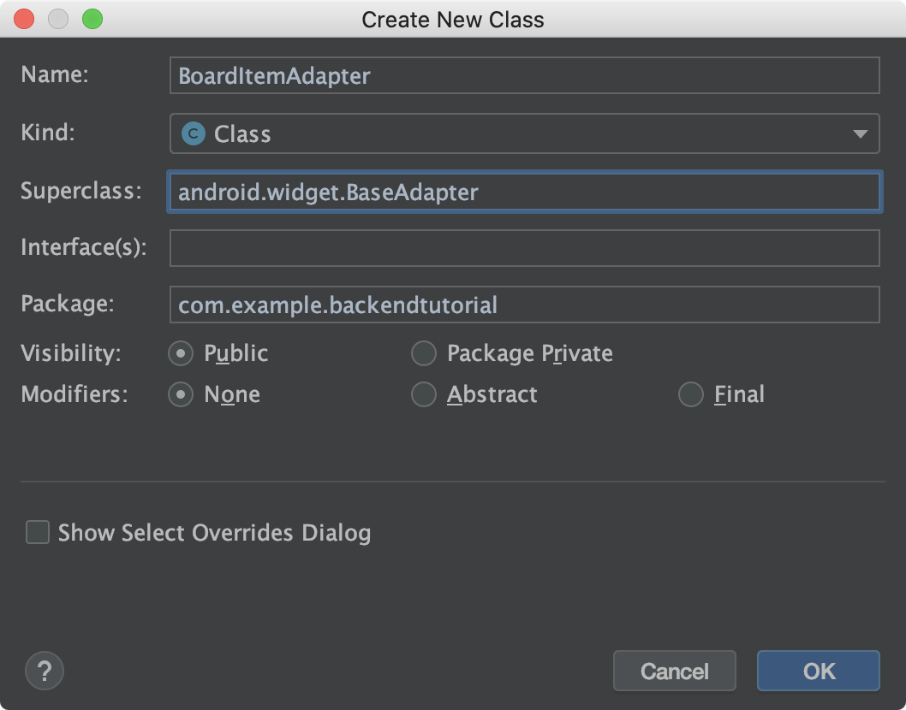

그러면 다음과 같이 class가 만들어진 것을 확인할 수 있습니다.

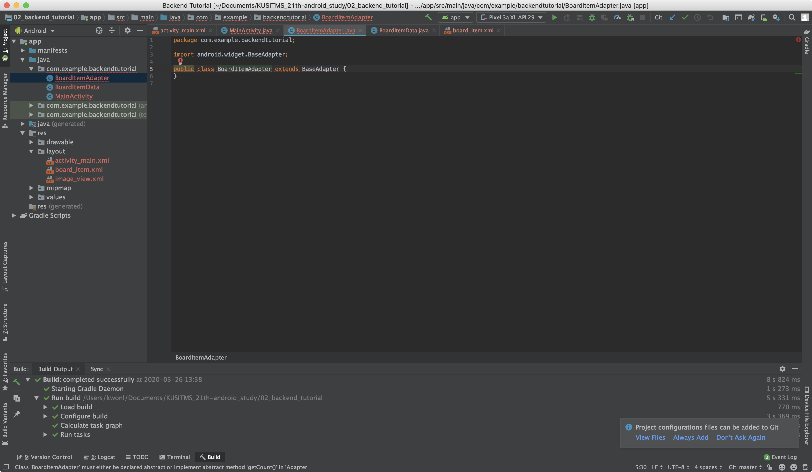

빨간 줄이 쳐져있죠? 상속을 받아서 Abstract method를 Override해주지 않아서 그렇습니다. 빨간줄에서 `ctrl + Enter`(맥의 경우 `command + Enter`)를 통해 기본 Abstract method들을 채워주도록 합시다!

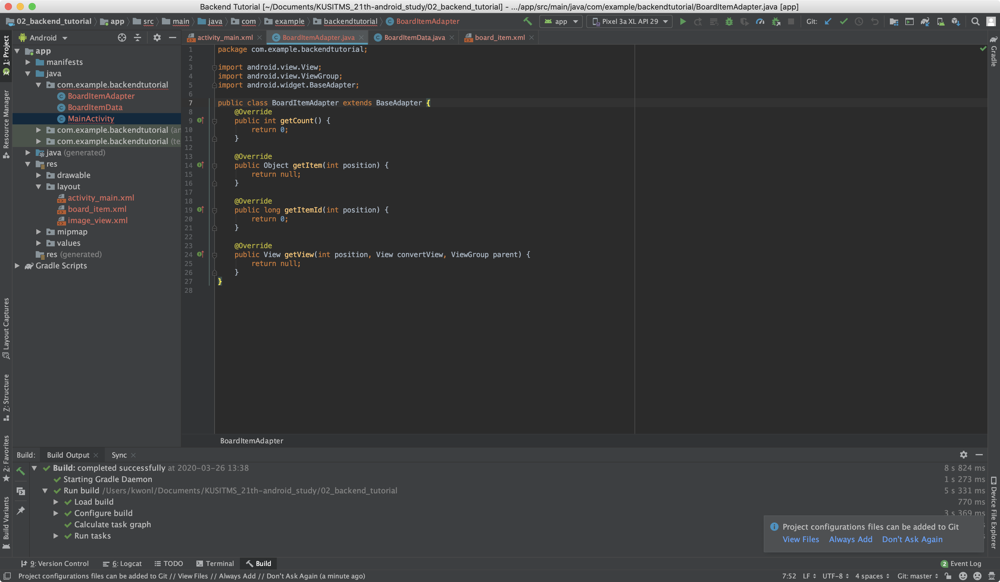

그러면 이제 구현을 해줘야겠죠? 먼저, BoardItemAdapter에서 사용할 ArrayList를 선언해줍시다. class 안에서 `ArrayList<BoardItemData> items` 이렇게요! 이 array list에 data를 저장해두고 우리가 원할 때마다 변경해줄거에요! C에서는 array, python에서는 list라고 생각하시면 됩니다.

각각의 함수를 살펴보도록 합시다.

1. `getCount`: 말 그대로 item의 count를 얻는 함수입니다. `return items.size()`를 통해 array list의 길이를 반환해주면 되겠죠?
2. `getItem`: 해당 position에서 어떤 item을 사용할 지를 반환하는 함수입니다.
3. `getItemId`: 딱히 신경쓰지 않아도 됩니다.
4. `getView`: 가장 중요한 함수인데, 해당 position에 대해서 우리가 만들어놓은 layout을 가져와 데이터를 입혀서 return해줘야 합니다. 그러면 ListView에서는 이 반환된 view를 가지고 콘텐츠를 채워넣게 됩니다.

제가 미리 만들어놓은 코드를 써보면 다음과 같습니다!

```java
package com.example.backendtutorial;

import android.content.Context;
import android.view.LayoutInflater;
import android.view.View;
import android.view.ViewGroup;
import android.widget.BaseAdapter;
import android.widget.TextView;

import java.util.ArrayList;

public class BoardItemAdapter extends BaseAdapter {
    Context context;
    ArrayList<BoardItemData> items;

    public BoardItemAdapter(Context context, ArrayList<BoardItemData> items) {
        this.context = context;
        this.items = items;
    }

    @Override
    public int getCount() {
        return items.size();
    }

    @Override
    public Object getItem(int position) {
        return items.get(position);
    }

    @Override
    public long getItemId(int position) {
        return position;
    }

    @Override
    public View getView(int position, View convertView, ViewGroup parent) {
        LayoutInflater inflater = (LayoutInflater) context.getSystemService(Context.LAYOUT_INFLATER_SERVICE);
        View board_item = inflater.inflate(R.layout.board_item, parent, false);

        TextView title = board_item.findViewById(R.id.titleView);
        TextView content = board_item.findViewById(R.id.contentView);
        title.setText(items.get(position).title);
        content.setText(items.get(position).content);

        return board_item;
    }
}
```

이러면 이제 inflation이 왜 이용되는지 알겠죠? 우리가 미리 만들어놓은 board_item이라는 item을 가져와서 inflation한 뒤에 콘텐츠를 채워넣는 것입니다.

이때, constructor를 보면 Context와 ArrayList를 받도록 되어있죠? Context는 자세한건 모르셔도 되는데, `getSystemService`등의 함수를 사용하기 위해서는 저 Context라는 친구가 필요합니다. 보통은 Activity를 전달하게 되고, 아니면 `getApplicationContext()`를 통해서 context를 전달할 수도 있습니다.

ArrayList의 경우는 우리가 MainActivity에서 데이터를 채워넣을 ArrayList를 넘겨주도록 하겠죠. 이제 이 ArrayList에 새로운 item을 추가할 때마다 Adapter에 이것을 받아 ListView에 올려주는거죠.

이제 MainActivity를 다음과 같이 바꾸면 끝입니다!

```java
public class MainActivity extends AppCompatActivity {

    ArrayList<BoardItemData> items = new ArrayList<>();
    BoardItemAdapter itemAdapter = new BoardItemAdapter(this, items);

    @Override
    protected void onCreate(Bundle savedInstanceState) {
        super.onCreate(savedInstanceState);
        setContentView(R.layout.activity_main);

        ListView listView = findViewById(R.id.boardList);
        listView.setAdapter(itemAdapter);

        items.add(new BoardItemData("테스트 제목1", "테스트 콘텐츠"));
        items.add(new BoardItemData("테스트 제목2", "테스트 콘텐츠"));
        items.add(new BoardItemData("테스트 제목3", "테스트 콘텐츠"));
        items.add(new BoardItemData("테스트 제목4", "테스트 콘텐츠"));

        itemAdapter.notifyDataSetChanged();
    }
}
```

items를 만들어서 Data를 채워주고, `notifyDataSetChanged`를 통해 ListView를 update하도록 해줍니다. 정말 쉽죠?

## GridView
그리드 뷰의 경우, ListView와 내부 구현이 같습니다. 다만 보여주는 방식의 차이일 뿐이죠. GridView의 numColumns를 설정해주고, 우리가 만들어놓은 board_item.xml을 grid에 어울리는 것으로 바꿔주면 끝! ㅎㅎ

## 마치며
오늘은 안드로이드의 backend에 대해서 많이 다뤄봤는데, 아마 너무 빠르게 해서 어려우실 수 있습니다.. Event와 Listener에 대해서 배웠고, Inflate가 왜 필요한지 배웠습니다. 그리고 끝판왕급인 ListView에 대해서 배웠죠?!

진도가 많이 빨라서 어렵다거나 이해가 안되는 부분 있으시면 언제든 저에게 갠톡 주세요 ㅎㅎ 저는 환영합니다.

수고하셨습니다!!