# 안드로이드 - REST API 스터디 4주차
벌써 4주차네요 여러분..이번 주 토요일은 큐데인데, 다들 기대하고 계신가요?! ㅎㅎ 저는 완전 기대하고 있습니다!! 이번에도 굉장히 재밌을거에요~

아무튼 벌써 안드로이드를 배운지 4주차가 되어갑니다. 이제 다음주면 안드로이드에 대한 공부를 마치고, 방학이 끝나면 백엔드에 대한 공부를 해보도록 할 것 같습니다. 정말 빠르죠?

오늘은 안드로이드의 Application 구성요소를 배워보고, Activity가 무엇인지, intent가 무엇인지 등에 대해서 배워볼 것입니다. 이에 따라 안드로이드에서의 화면 전환이 어떻게 일어나는지 한번 보도록 하죠!

## Android Application의 구성요소
안드로이드에서 application을 구성하는 요소는 다음과 같이 나눌 수 있습니다(라고 합니다).

1. Activity: application의 화면을 그리는 classs
2. Service: 화면이 없지만 background에서 돌아가도록 하는 class
3. Broadcast receiver: system 이벤트가 발생할 시 application에 전달될 수 있도록 해주는 class
4. Content provider: 갤러리, 디바이스 폴더 등 리소스를 시스템으로부터 제공받는 것.

위 class들은 모두 android sdk에서 제공하는 class들입니다. 왜 이것들을 application의 구성요소라고 부를까요? 위 class들은 모두 android의 system에 의해 관리되기 때문입니다. 저희가 위 구성 요소들을 만들게 되면 android의 system이 그것을 보고 앱을 구동하게 되는 것이죠. 따라서 위와 같은 구성요소들을 정의하는 파일이 필요하겠죠? 그것이 바로 `AndroidManifest.xml`입니다.

`AndroidManifest.xml`에는 Acitivity를 비롯한 많은 앱에 대한 설정이 저장되어 있습니다. 폰의 리소스를 사용할 권한도 그 중 하나죠. 나중에 저희가 인터넷을 사용하게 되면 위 파일을 바꿔서 권한을 획득해야 할 것입니다. 이런 권한 설정도 모두 `AndroidManifest.xml`에서 관리하도록 되어 있죠! 매우 중요한 친구겠죠? 나중에 살펴보도록 합시다.

## Activity와 Intent
제가 위에서 Activity는 화면을 그리는 것이라고 말씀드렸죠? 우리는 지금까지 알게모르게 많이 사용해왔습니다. `MainActivity.java`와 `activity_main.xml`을 통해서 정의를 했었죠? 이것이 한 화면을 그리는 요소가 됩니다. 생소하지는 않죠?

그런데 앱을 보면 화면이 여러개가 나옵니다. 인스타그램만 해도 댓글을 클릭하면 다른 화면으로 넘어가죠? 그러면 안드로이드에서 다른 화면은 어떻게 만들고 넘어갈 수 있을까요? 답은 간단하겠죠! 바로 새로운 Activity를 만들면 됩니다.

### Activity 만들기
그러면 새로운 Activity를 만들어봅시다. 다음과 같이 app에서 우클릭을 한 뒤, `New->Activity->(만들 Activity 종류)`를 통해 새로운 Activity를 생성할 수 있습니다.

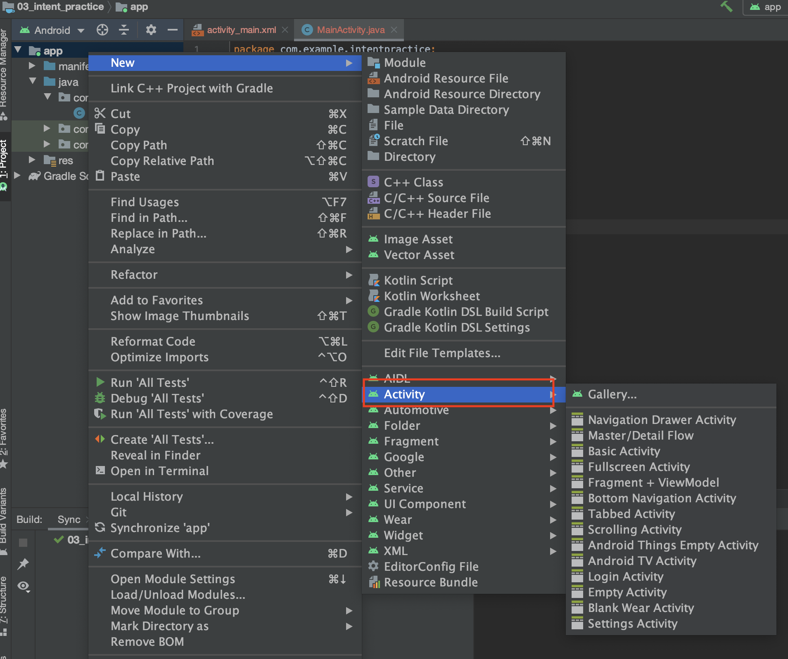

빈 Activity를 다음과 같이 만들어보도록 하죠.

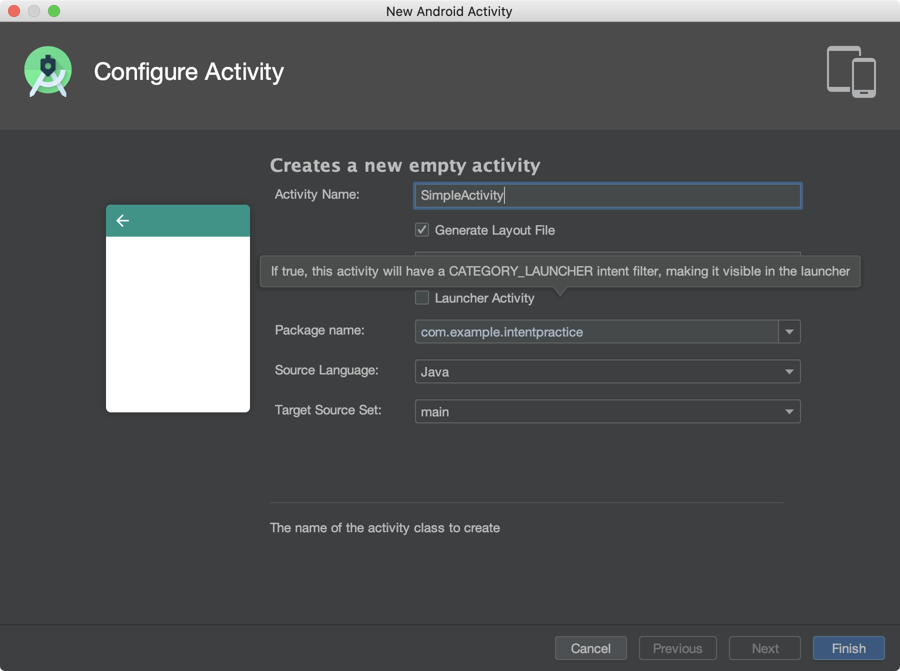

보통 Activity의 이름은 `SimpleActivity`와 같이 첫글자와 A를 대문자로 하고, 이에 따른 layout xml은 `activity_(이름)` 과 같이 지정이 됩니다. 이렇게 새로운 Activity를 추가하면, 잠깐의 build 이후에 activity가 추가됩니다. `SimpleActivity.java`는 물론이고 `activity_simple.xml`이 생성되죠?

menifests를 클릭하여 열어봅시다. 다음과 같이 바뀌어 있을 겁니다.

```xml
<?xml version="1.0" encoding="utf-8"?>
<manifest xmlns:android="http://schemas.android.com/apk/res/android"
    package="com.example.intentpractice">

    <application
        android:allowBackup="true"
        android:icon="@mipmap/ic_launcher"
        android:label="@string/app_name"
        android:roundIcon="@mipmap/ic_launcher_round"
        android:supportsRtl="true"
        android:theme="@style/AppTheme">
        <activity android:name=".SimpleActivity"></activity>
        <activity android:name=".MainActivity">
            <intent-filter>
                <action android:name="android.intent.action.MAIN" />

                <category android:name="android.intent.category.LAUNCHER" />
            </intent-filter>
        </activity>
    </application>

</manifest>
```

잘 보면 `<activity android:name=".SimpleActivity"></activity>` 이부분이 추가되었죠? 앞서 말씀드렸다시피, Activity는 class를 기반으로 안드로이드 시스템에서 관리하는 것이기 때문에 menifest 파일에 추가된 것입니다.

### Intent를 이용하여 화면 전환
이제 이 새로운 액티비티로 가려면 어떻게 해야할까요? 일단 새로운 Activity를 다음과 같이 바꿔보죠.

```xml
<!-- activity_simple.xml -->

<?xml version="1.0" encoding="utf-8"?>
<androidx.constraintlayout.widget.ConstraintLayout xmlns:android="http://schemas.android.com/apk/res/android"
    xmlns:app="http://schemas.android.com/apk/res-auto"
    xmlns:tools="http://schemas.android.com/tools"
    android:layout_width="match_parent"
    android:layout_height="match_parent"
    tools:context=".SimpleActivity">

    <Button
        android:id="@+id/finishButton"
        android:layout_width="wrap_content"
        android:layout_height="wrap_content"
        android:text="Finish simple activity"
        app:layout_constraintBottom_toBottomOf="parent"
        app:layout_constraintEnd_toEndOf="parent"
        app:layout_constraintStart_toStartOf="parent"
        app:layout_constraintTop_toTopOf="parent" />
</androidx.constraintlayout.widget.ConstraintLayout>
```

그리고, `activity_main.xml`과 MainActivity.java를 다음과 같이 바꿔봅시다.

```xml
<!-- activity_main.xml -->

<?xml version="1.0" encoding="utf-8"?>
<androidx.constraintlayout.widget.ConstraintLayout xmlns:android="http://schemas.android.com/apk/res/android"
    xmlns:app="http://schemas.android.com/apk/res-auto"
    xmlns:tools="http://schemas.android.com/tools"
    android:layout_width="match_parent"
    android:layout_height="match_parent"
    tools:context=".MainActivity">

    <Button
        android:id="@+id/navButton"
        android:layout_width="wrap_content"
        android:layout_height="wrap_content"
        android:text="Navigate to simple Activity"
        app:layout_constraintBottom_toBottomOf="parent"
        app:layout_constraintEnd_toEndOf="parent"
        app:layout_constraintStart_toStartOf="parent"
        app:layout_constraintTop_toTopOf="parent" />
</androidx.constraintlayout.widget.ConstraintLayout>
```

```java
/* MainActivity.java */

public class MainActivity extends AppCompatActivity {

    @Override
    protected void onCreate(Bundle savedInstanceState) {
        super.onCreate(savedInstanceState);
        setContentView(R.layout.activity_main);

        Button navButton = findViewById(R.id.navButton);
        navButton.setOnClickListener(new View.OnClickListener() {

            @Override
            public void onClick(View v) {
                Intent intent = new Intent(getApplicationContext(), SimpleActivity.class);
                startActivity(intent);
            }
        });
    }
}
```

드디어 intent라는 것이 등장했네요. 이 intent는 무엇일까요? 알아보기 전에 일단 실행시켜봅시다. button을 누르면 다음 Activity로 전환되는 것을 확인할 수 있습니다.

intent라는 것은 거창한 것이 아닙니다. 위 코드는 `startActivity` 함수를 실행시켜서 바로 새로운 액티비티를 화면에 그리는 것처럼 보이지만, 실제로는 안드로이드 시스템에서 내부적으로 intent를 이용해 새로운 액티비티를 실행하는 것입니다. 아래 그림과 같이요!

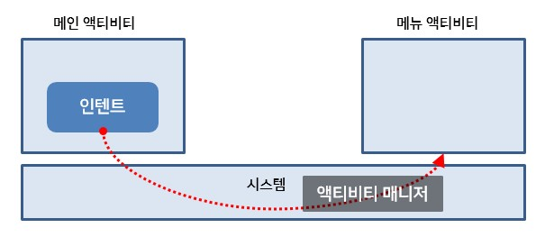
> 출처: 네이버 부스트코스 안드로이드 강좌

intent는 안드로이드 시스템 내부에서 activities, content providers, broadcast receivers, services 등의 안드로이드 내부 구성요소들이 communicate할 때 사용하는 message입니다. 어렵지 않죠? 따라서 새로운 activity를 실행할 때, 현재 activity에서 새로운 activity를 호출하기 위해 intent를 사용하는 것입니다.

그렇다면 다시 새로운 activity로 돌아와서, 새로운 activity를 끝내려면 어떻게 해야할까요? 

```java
/* SimpleActivity.java */

public class SimpleActivity extends AppCompatActivity {

    @Override
    protected void onCreate(Bundle savedInstanceState) {
        super.onCreate(savedInstanceState);
        setContentView(R.layout.activity_simple);

        Button finishButton = findViewById(R.id.finishButton);
        finishButton.setOnClickListener(new View.OnClickListener() {

            @Override
            public void onClick(View v) {
                finish();
            }
        });
    }
}
```

위와 같이 단순히 `finish()` 함수를 불러주면 됩니다. Activity는 stack형식으로 쌓이기 때문에 이전의 MainActivity로 돌아가게 되죠. stack은 자료구조를 배워서 다들 알고계시겠죠? 이렇듯 `startActivity`는 사실상의 함수 호출이라고 생각하셔도 됩니다.

### More about Intent
#### Intent로 전화 화면 띄우기
Intent는 새로운 Activity를 띄우는 것 이외에도 안드로이드 시스템에서 이용되는 message라고 했죠? 즉, 우리는 android의 서비스를 이용할 때도 Intent를 사용합니다. 다음 코드를 한번 볼까요?

```java
public class MainActivity extends AppCompatActivity {

    @Override
    protected void onCreate(Bundle savedInstanceState) {
        super.onCreate(savedInstanceState);
        setContentView(R.layout.activity_main);

        Button navButton = findViewById(R.id.navButton);
        navButton.setOnClickListener(new View.OnClickListener() {

            @Override
            public void onClick(View v) {
                Intent intent = new Intent(Intent.ACTION_DIAL, URI.parse("tel:010-4019-3238"));
                startActivity(intent);
            }
        });
    }
}
```

`Intent` class는 여러가지의 contructor를 가집니다. 따라서 우리가 이용하고 싶은 서비스 종류에 따라 여러 형태의 constructor를 이용할 수 있죠! 위 같은 경우 Intent에서 제공하는 Action중 `ACTION_DIAL`을 통해 전화걸기를 실행해봤습니다.

#### 동적으로 Activity 띄우기
다음과 같은 code를 통해 string으로부터 Intent를 만들 수 있습니다.

```java
Intent intent = new Intent();
ComponentName name = new ComponentName("org.techtown.intent", "org.techtown.intent.MenuActivity");

intent.setComponent(name);
startActivity(intent);
```

위와 같이 하면 Class이름을 패키지까지 포함해야해서 복잡해보일 수 있지만, 동적으로 Activity를 실행해야 할 경우 유용하게 사용할 수 있습니다.

#### Activity를 위한 플래그
Activity를 실행하면 그것이 stack으로 쌓여서 관리된다고 했죠? 그런데 같은 Activity가 stack에 쌓이게되면 어떻게 될까요? 예를 들어 activity **#0**, **#1**, **#2**가 있다고 해봅시다.

**#0**에서 **#1**을 실행시키고, **#1**에서 **#2**를, 그리고 다시 **#2**에서 **#0**을 실행시킨다고 생각해봅시다. 그러면 stack에는 **#0** -> **#1** -> **#2** -> **#0** 이렇게 쌓여있게 되겠죠? activity를 종료하면 **#0**이 두번 나오게 되겠죠? 이런걸 막아주는 것이 바로 `FLAG_ACTIVITY_SINGLE_TOP`입니다. `intent.addFlag(Intent.FLAG_ACTIVITY_SINGLE_TOP)`와 같이 flag를 설정해줄 수 있는데, flag가 없을 때와의 차이는 다음과 같습니다.

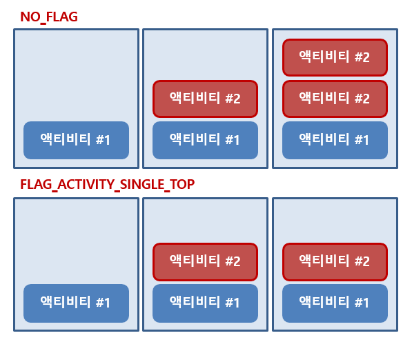
> 출처: 네이버 부스트코스 안드로이드 강좌

### Acitivity의 수명주기
지금부터는 activity의 수명 주기에 대해서 알아볼 겁니다. 우리는 계속해서 `onCreate()`라는 함수를 봤었죠? 이 함수는 activity class의 member function인데, 말 그대로 activity가 만들어질 때 어떤 행동을 할지 정의하는 함수입니다. 보통 button에 `onClickListener`를 달아준다던가 하는 등의 행동은 당연히 Activity가 시작할 때 해주는 것이 좋겠죠? 그래서 onCreate에서 기본적으로 event driven 코드를 모두 달아놓게 됩니다. 안드로이드에서는 이외에도 acitivity의 어러 수명주기에 관한 함수들이 있습니다.


> 출처: [안드로이드 공식 홈페이지](https://developer.android.com/guide/components/activities/activity-lifecycle?hl=ko)

위 그림을 보면 알 수 있듯, `onCreate()`이외에도 `onStart()`, `onStop()`등의 함수들이 있는 것을 알 수 있습니다. 대충 설명하자면 다음과 같습니다.

1. `onCreate`: activity의 생성 시에 호출되는 함수로, 아직 activity가 화면에 표시되지 않습니다.
2. `onStart()`: activity가 시작할 때 호출되는 함수로, activity가 화면에 비춰지기 시작합니다.
3. `onResume()`: 잠시 멈췄다가 시작할 때 호출되는 함수로, 알림창이 발생하거나 다른 application에 의해 앱이 반투명화된 상태 등에 호출됩니다. 예를 들면 요즘 많이 오는 긴급문자..같은게 오면 `onPause()`가 불리고..긴급문자를 닫으면 `onResume()`이 호출됩니다.
4. `onPause()`: 위에서 설명한 것과 같습니다.
5. `onStop()`: App이 완전히 background로 전환되거나 다른 activity가 실행되어 현재 activity를 덮어버릴 경우 사용됩니다. 화면에 표시될 data를 저장하는 것은 주로 이 함수에서 작성합니다.
6. `onDestroy()`: activity가 완전히 파괴될 때 사용됩니다.

이걸 이해하는 가장 빠른 방법은 역시 log를 찍어보면서 액티비티를 변화시켜보는 것입니다.

액티비티의 수명 주기에 따라서 local variable이나 화면의 상태를 저장하고자 할 대는 `SharedPreference`나 `onSaveInstanceState()`등을 이용하면 됩니다. 우리에게는 별로 중요한 것이 아니니 일단 넘어가도록 하죠.

## Service
서버쪽 공부를 해보신 분이라면 이 service라는 용어가 익숙하실 겁니다. apache나 nginx등의 서버들은 daemon으로써 service로 돌아가죠? 모르셔도 상관 없습니다.

service는 보통 background에서 실행되는 process를 말하는데, 항상 실행되고 있어야 하는 것들을 말합니다. 얘를 들어 카카오톡에서 알림이 왔을 때 수신하려면 background에서 항상 서버로부터 수신을 하고 있어야겠죠? 이러한 역할을 맡는 것이 service입니다. 따라서 service의 경우 한번 실행시키면 계속 실행되는 상태로 유지가 됩니다. 비정상 종료가 되는 경우 android에서 자동으로 재시작을 해주죠!

service또한 `onCreate()`, `onDestroy()`함수가 있습니다. 아래 그림과 같이 작동을 하죠!

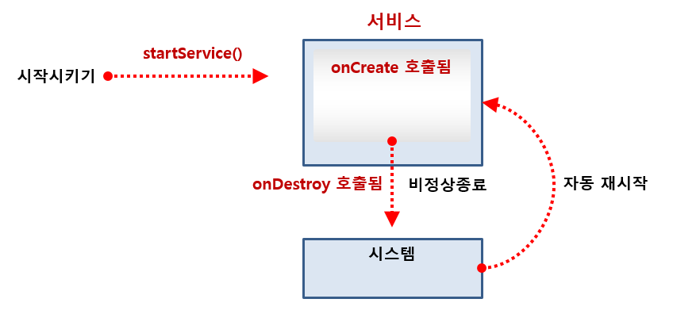

service를 시작하는 것은 Activity와 같습니다. intent를 생성하고, 이를 `startService()`로 전달하여 시작할 수 있죠. service는 activity와 같이 New->service를 통해 만들 수 있습니다. 다음 코드를 한번 볼까요?

```java
/* SimpleService.java */
public class SimpleService extends Service {
    private static String TAG = "SimpleService";

    @Override
    public void onCreate() {
        Log.d(TAG, "onCreate: called");
    }

    @Override
    public int onStartCommand(Intent intent, int flags, int startId) {
        Log.d(TAG, "onStartCommand: called");

        Log.d(TAG, "onStartCommand: command is " + intent.getStringExtra("command"));
        Log.d(TAG, "onStartCommand: none is " + intent.getStringExtra("none"));

        return super.onStartCommand(intent, flags, startId);
    }

    @Override
    public void onDestroy() {
        Log.d(TAG, "onDestroy: called");
    }

    @Nullable
    @Override
    public IBinder onBind(Intent intent) {
        // 잘 사용하지 않습니다. 보통 main worker에서 IPC로 소통할 때 사용.
        return null;
    }
}
```

그렇다면 service는 한번 실행시켜놓으면 `startService()`를 호출할 일이 없을까요? 그렇지 않습니다. service가 돌아가는 와중에 service로 어떤 값을 전달해야할 일이 생기겠죠? 이것을 위해 `onStartCommand()`가 있습니다. `onCreate()`는 service가 만들어질 때 호출되고, `onStartCommand()`는 `startService()`를 통해 service가 불렸을 때 호출됩니다. 즉, `startService()`를 통해 계속해서 service로 변수를 전달할 수 있겠죠? 어떻게 전달을 할까요?

```java
/* MainActivity.java */
public class MainActivity extends AppCompatActivity {

    @Override
    protected void onCreate(Bundle savedInstanceState) {
        super.onCreate(savedInstanceState);
        setContentView(R.layout.activity_main);

        Button button = findViewById(R.id.button);
        button.setOnClickListener(new View.OnClickListener() {

            @Override
            public void onClick(View v) {
                Intent intent = new Intent(getApplicationContext(), SimpleService.class);
                intent.putExtra("command", "show");
                startService(intent);
            }
        });
    }
}
```

위 코드와 같이, intent에서 `putExtra()`와 `getStringExtra()`를 이용하여 변수를 전달할 수 있습니다. 이는 activity도 마찬가지겠지요?! 이제 로그를 찍어보면서 돌아가는 것을 이해해봅시다.

그렇다면 서비스에서 activity로 값을 전달하려면 어떻게 할까요? service는 화면이 없으므로 여러가지 flag가 필요합니다. 다음과 같이 사용할 수 있죠.

```java
Intent showIntent = new Intent(getApplicationContext(), MainActivity.class);
showIntent.addFlags(Intent.FLAG_ACTIVITY_NEW_TASK | Intent.FLAG_ACTIVITY_SINGLE_TOP | Intent.FLAG_ACTIVITY_CLEAR_TOP);

showIntent.putExtra("command", "show");

startActivity(showIntent);
```

`FLAG_ACTIVITY_NEW_TASK`를 통해 activity로 전환하고, `FLAG_ACTIVITY_SINGLE_TOP`로 중복된 activity가 생기지 않도록 하고, `FLAG_ACTIVITY_CLEAR_TOP`를 통해 새로운 activity를 만들지 않고 이미 background에 있는 activity를 foreground로 가져옵니다.

즉, 새로운 activity를 만들지 않고 intent만 전달하는 효과를 가지죠. activity에서는 다음과 같이 전달받을 수 있습니다.

```java
@Override
protected void onNewIntent(Intent intent) {
    processIntent(intent);

    super.onNewIntent(intent);
}
```

## Broadcast Receiver
우리는 4가지 구성요소중 두가지를 배웠습니다. content provider의 경우 나중에 배워보도록 하고, 3번째 요소인 broadcast receiver에 대해서 배워보도록 하죠!

이 broadcast receiver는 일종의 listener라고 생각하시면 됩니다. 안드로이드에서 system event가 발생했을 때 application에 알려주는 것이죠! 우리는 SMS메시지가 도착했을 때 어떻게 이 receiver를 사용할 수 있는지 배워봅시다.

### Permission check
그 전에, 안드로이드의 서비스를 이용하기 위해서는 권한이 필요합니다. 앱을 실행해보면 여러번 보셨죠? 미디어 파일 접근 권한이나, 카메라 접근 권한 등을 묻는 메시지가 있죠! 이러한 권한들은 악성 프로그램으로부터 우리의 핸드폰을 지켜주는 역할을 합니다. 그러니까 여러분은 권한을 요청하는 것에 대해 함부로 허용을 누르면 안됩니다..

아무튼 우리는 SMS 메시지에 접근할 권한을 요청해야합니다. 바로 menifest 파일에서 다음과 같이 명시해놔야 하죠!

```xml
<?xml version="1.0" encoding="utf-8"?>
<manifest xmlns:android="http://schemas.android.com/apk/res/android"
    package="com.example.intentpractice">

    <uses-permission android:name="android.permission.RECEIVE_SMS" />

    <application
        android:allowBackup="true"
        android:icon="@mipmap/ic_launcher"
        android:label="@string/app_name"
        android:roundIcon="@mipmap/ic_launcher_round"
    >

<!-- 이후 생략... -->
```

`<uses-permission android:name="android.permission.RECEIVE_SMS" />` 이렇게 명시해놓으면 우리는 SMS를 받는 permission을 요청하는 것입니다. 그런데, android marshmallow 이후부터는 이렇게 권한을 명시하는 것 이외에도 할 일이 있습니다. 그것은 바로 code상에서 runtime에 권한을 명시하는 것입니다. 다음과 같은 코드로 permission을 요청할 수 있습니다.

```java
/* MainActivity.java */

public class MainActivity extends AppCompatActivity {

    @Override
    protected void onCreate(Bundle savedInstanceState) {
        super.onCreate(savedInstanceState);
        setContentView(R.layout.activity_main);

        checkPermissions();
    }

    protected void checkPermissions() {
        String[] PERMISSIONS = {
            Manifest.permission.RECEIVE_SMS
        };

        if (ContextCompat.checkSelfPermission(this, Manifest.permission.RECEIVE_SMS)
                != PackageManager.PERMISSION_GRANTED) {
            requestPermissions(PERMISSIONS, 1);
        }
    }
}
```

`checkPermissions()`라는 함수를 새로 구현했죠? 이렇게 하면 앱이 실행되자마자 다음과 같이 권한요청을 하는 창이 뜹니다.

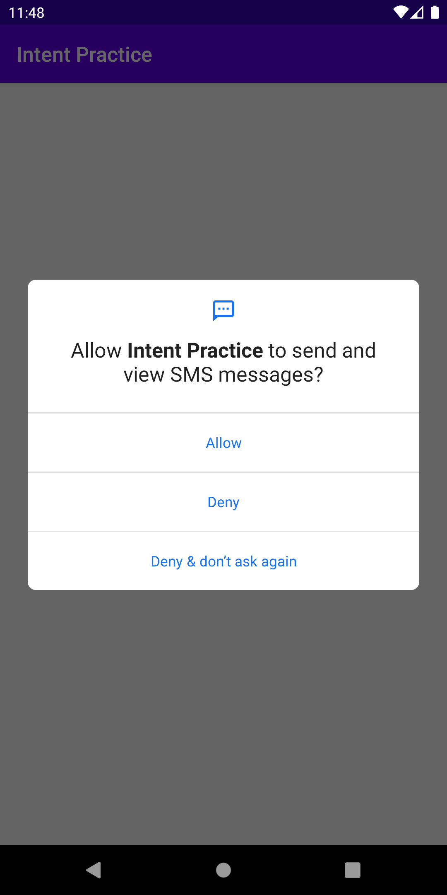

여기서 Allow를 눌러주도록 합시다.

### SMS receiver
다음과 같이 새로운 receiver를 만들어주도록 합시다.

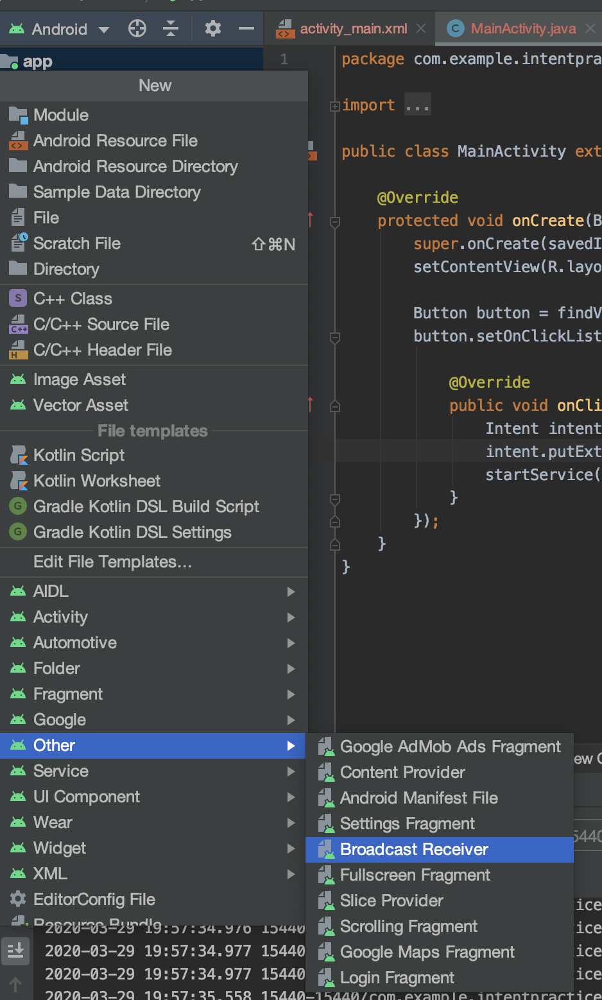

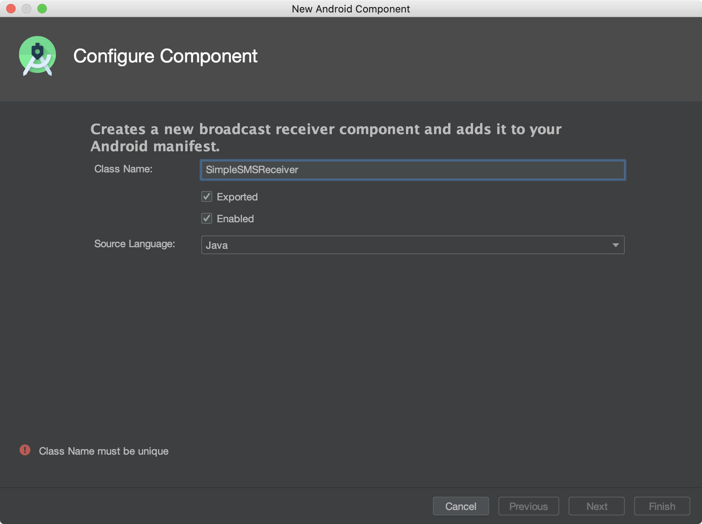

이러면 menifest파일에 자동으로 receiver가 추가되는데, 우리는 모든 intent를 받을 것이 아니고 SMS에 관련된 intent만 받을 것이죠? 따라서 다음과 같이 intent filter를 추가해줍시다.

```xml
<!-- AndroidMenifest.xml -->
<receiver
    android:name=".SimpleSMSReceiver"
    android:enabled="true"
    android:exported="true">
    <intent-filter>
        <action android:name="android.provider.Telephony.SMS_RECEIVED" />
    </intent-filter>
</receiver>
```

위와같이 설정해줌으로써, 우리가 만든 Receiver class는 SMS를 받았을 때의 intent만 listen하도록 됩니다.

그리고 코드는 다음과 같이 써줍시다.

```java
/* SimpleSMSReceiver.java */

public class SimpleSMSReceiver extends BroadcastReceiver {
    private static String TAG = "SimpleSMSReceiver";

    @Override
    public void onReceive(Context context, Intent intent) {
        Log.d(TAG, "onReceive: called");

        SmsMessage[] messages = parseMessage(intent.getExtras());

        if (messages.length > 0) {
            String content = messages[0].getMessageBody().toString();
            Log.d(TAG, "onReceive: Message content is: " + content);
        }
    }

    private SmsMessage[] parseMessage(Bundle bundle) {
        Object[] objs = (Object[]) bundle.get("pdus");
        SmsMessage[] messages = new SmsMessage[objs.length];

        for (int i = 0; i < objs.length; i++) {
            String format = bundle.getString("format");
            messages[i] = SmsMessage.createFromPdu((byte[]) objs[i], format);
        }

        return messages;
    }
}
```

위와 같은 코드로 SMS 메시지를 받아 내용을 출력할 수 있습니다. 가끔 SMS인증하는 앱중에서 자동으로 인증번호를 채워주는 앱들이 있었죠? 이제 우리도 그러한 앱을 만들 수 있습니다!!!

메시지를 테스트하는 방법은 다음과 같습니다. simulator에서 오른쪽 메뉴에서 더보기(점 세개)를 클릭한 뒤, Phone으로 들어가면 메시지를 보낼 수 있습니다.

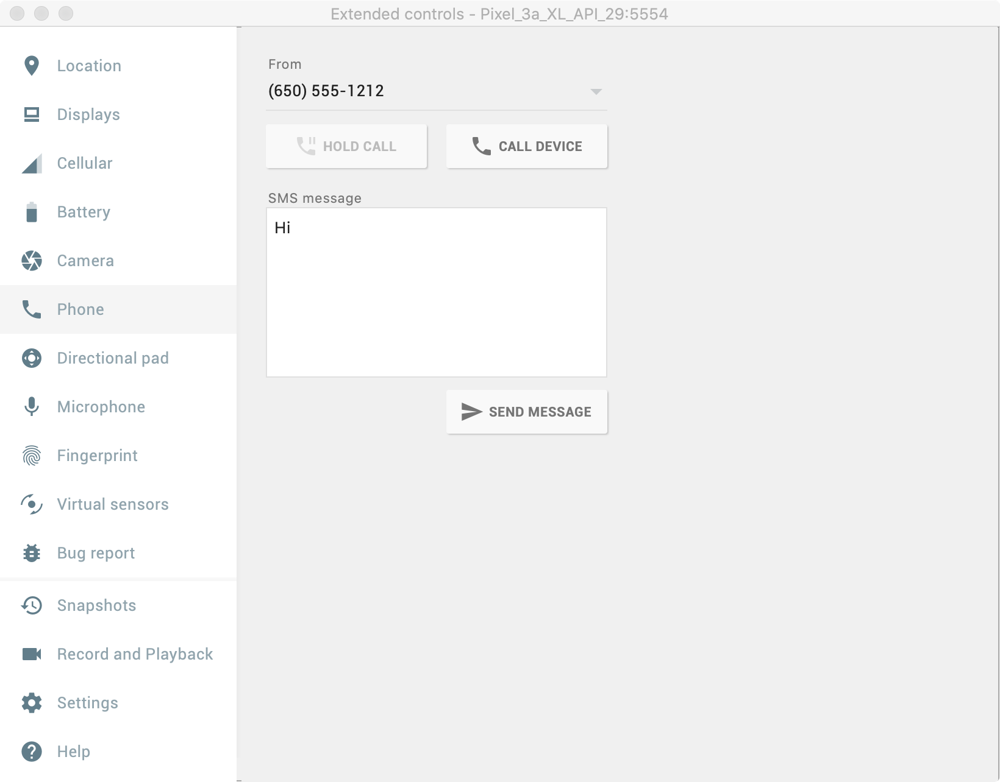

## Fragment
이제 fragment와 tab, view pager 등의 화면 navigation에 대해서 알아봅시다! 먼저 시작하기 전에, 새로운 프로젝트를 만들도록 합시다. App의 이름은 **Screen Navigation**으로 하고, 프로젝트는 **04_screen_navigation**정도로 해줍시다.

### Fragment란?
fragment는 layout의 재사용을 위해 사용됩니다. 가벼운 activity라고 생각하시면 편한데요! 예를 들어 여러분이 어떤 레이아웃을 만들었다고 할 때, 이것을 다른 activity에서 사용하려면 어떻게 해야할까요? xml코드를 복붙하여 사용할 수도 있지만, 굉장히 비효율적일 것입니다. 이렇듯 코드의 재사용을 위해 만들어진 것이 fragment입니다. fragment는 activity와 같이 java파일과 xml파일로 이루어져 있고, 수명주기가 있습니다. activity와 다른 점은 다음과 같습니다.

1. `onAttach()`, `onDetach()`가 있다. 각각 activity위에 올라갈 때, 내려갈 때 호출된다.
2. activity가 시스템 역할을 하여 훨씬 가볍게 관리된다.
3. activity와는 다르게 intent가 아니라 함수 호출로 activity와 소통한다. 다음 그림과 같다!
    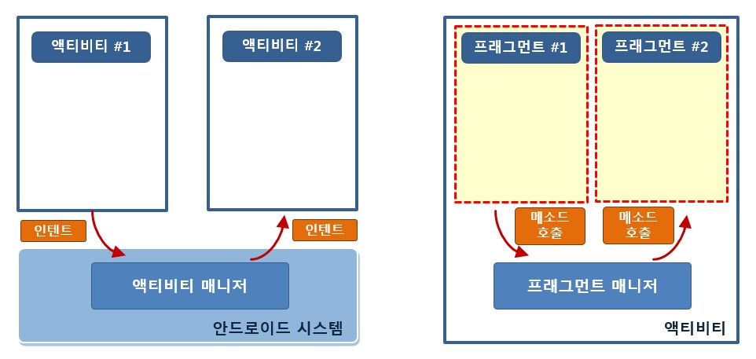

### Fragment를 이용한 간단한 앱 만들어보기
Fragment를 이용하여 버튼을 누를 때마다 다른 이미지가 나오는 앱을 만들어보도록 합시다.

일단 [이 파일](res.zip)을 다운받아서 drawable에 추가해줍니다.

다음과 같이 `app->우클릭->New->Fragment->fragment(Blank)`를 클릭합시다.

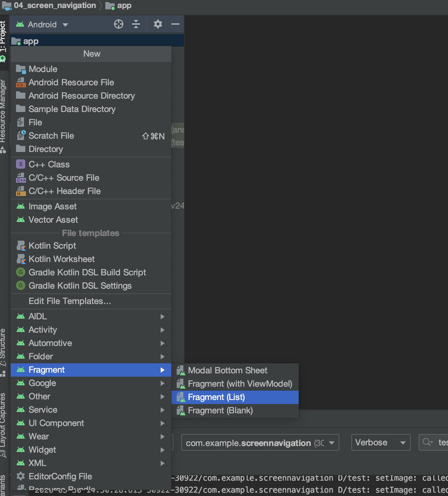

그리고 다음 그림과 같이 정보를 입력해줍시다. 이 때, **Include fragment factory method?**에 체크를 해제해줍시다.

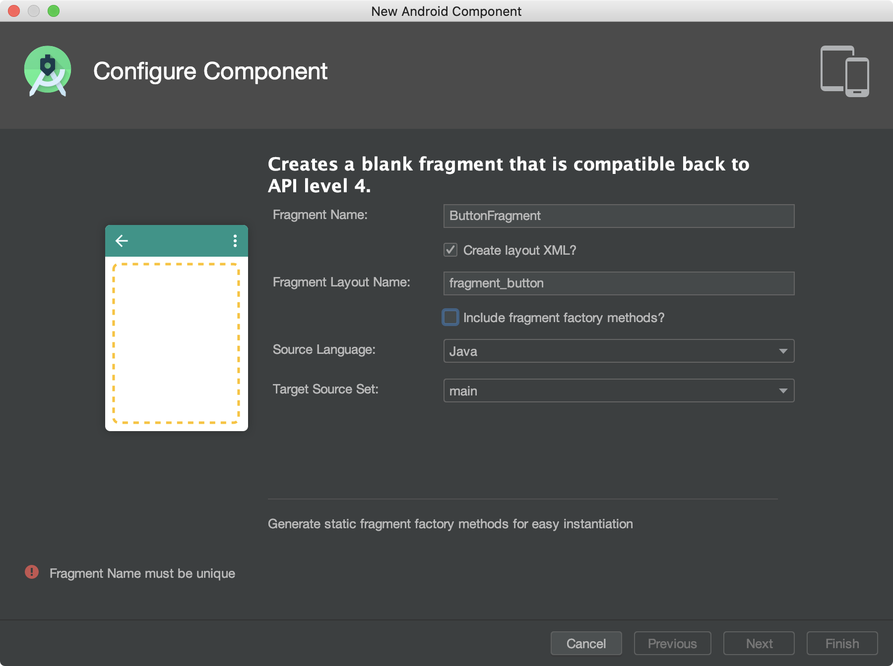

이 과정을 똑같이 하여 `ButtonFragment`와 `ImageFragment`를 만들어줍시다. fragment를 만들면 다음의 코드가 기본적으로 있을 것입니다.

```java
/* ButtonFragment.java */

@Override
public View onCreateView(LayoutInflater inflater, ViewGroup container,
                            Bundle savedInstanceState) {
    return inflater.inflate(R.layout.fragment_button, container, false);
}
```

그렇습니다. fragment는 재사용 가능한 layout이기 때문에 inflation을 통해 activity에 올려줘야 합니다. `onCreateView()`는 activity에서 fragment를 사용할 때 호출된다고 생각하시면 됩니다. activity의 `onCreate()`와 비슷하겠죠?

일단 이미지를 표시할 `ImageFragment`의 layout을 만들어줍시다.

```xml
<!-- fragment_image.xml -->

<?xml version="1.0" encoding="utf-8"?>
<FrameLayout xmlns:android="http://schemas.android.com/apk/res/android"
    xmlns:app="http://schemas.android.com/apk/res-auto"
    xmlns:tools="http://schemas.android.com/tools"
    android:layout_width="match_parent"
    android:layout_height="match_parent"
    tools:context=".ImageFragment">

    <androidx.constraintlayout.widget.ConstraintLayout
        android:layout_width="match_parent"
        android:layout_height="match_parent">

        <ImageView
            android:id="@+id/imageView"
            android:layout_width="wrap_content"
            android:layout_height="wrap_content"
            android:src="@drawable/sample1"
            app:layout_constraintBottom_toBottomOf="parent"
            app:layout_constraintEnd_toEndOf="parent"
            app:layout_constraintStart_toStartOf="parent"
            app:layout_constraintTop_toTopOf="parent" />
    </androidx.constraintlayout.widget.ConstraintLayout>
</FrameLayout>
```

그리고 `ButtonFragment`의 layout도 만들어줍시다.

```xml
<!-- fragment_button.xml -->

<?xml version="1.0" encoding="utf-8"?>
<FrameLayout xmlns:android="http://schemas.android.com/apk/res/android"
    xmlns:tools="http://schemas.android.com/tools"
    android:layout_width="match_parent"
    android:layout_height="match_parent"
    tools:context=".ButtonFragment">

    <LinearLayout
        android:layout_width="match_parent"
        android:layout_height="match_parent"
        android:orientation="vertical">

        <Button
            android:id="@+id/button1"
            android:layout_width="match_parent"
            android:layout_height="wrap_content"
            android:text="Button1" />

        <Button
            android:id="@+id/button2"
            android:layout_width="match_parent"
            android:layout_height="wrap_content"
            android:text="Button2" />

        <Button
            android:id="@+id/button3"
            android:layout_width="match_parent"
            android:layout_height="wrap_content"
            android:text="Button3" />
    </LinearLayout>
</FrameLayout>
```

각각의 fragment를 이용하기 위해서는 activity에서 fragment를 추가해주면 됩니다. 이 때, 각각의 fragment에 id를 부여해주도록 합시다.

```xml
<?xml version="1.0" encoding="utf-8"?>
<LinearLayout xmlns:android="http://schemas.android.com/apk/res/android"
    xmlns:app="http://schemas.android.com/apk/res-auto"
    xmlns:tools="http://schemas.android.com/tools"
    android:layout_width="match_parent"
    android:layout_height="match_parent"
    android:orientation="vertical">

    <fragment
        android:id="@+id/buttonFragment"
        android:name="com.example.screennavigation.ButtonFragment"
        android:layout_width="match_parent"
        android:layout_height="0dp"
        android:layout_weight="0.3" />

    <fragment
        android:id="@+id/imageFragment"
        android:name="com.example.screennavigation.ImageFragment"
        android:layout_width="match_parent"
        android:layout_height="0dp"
        android:layout_weight="0.7" />
</LinearLayout>
```

편의성을 위해 activity_main을 linear layout으로 바꿔줬습니다.

이제 각각의 button을 누를 때마다 아미지를 바꿔주도록 할 것입니다. 그런데, 문제가 생겼습니다. 우리는 `ButtonFragment`에서 `ImageFragment`의 view에 접근할 수 없습니다. 왜냐하면 fragment는 실제로는 activity에서 사용할 때 instance가 만들어지는 것이기 대문이죠. 그렇기 때문에 fragment에서 다른 fragment의 view를 건드리기 위해서는 activity를 거쳐야합니다.

`MainActivity`에 `onImageChange()`라는 함수를 새로 정의해주도록 합니다.

```java
public class MainActivity extends AppCompatActivity {
    @Override
    protected void onCreate(Bundle savedInstanceState) {
        super.onCreate(savedInstanceState);
        setContentView(R.layout.activity_main);
    }

    public void onImageChanged(int index) {

    }
}
```

우리는 button이 눌렸을 때 `onImageChanged`라는 함수를 불러서 `ImageFragment`의 view를 바꿔줄 겁니다. `ButtonFragment`를 다음과 같이 바꿔줍시다.

```java
/* ButtonFragment.java */

public class ButtonFragment extends Fragment {
    private View rootView;
    private MainActivity activity;

    @Override
    public void onAttach(Context context) {
        super.onAttach(context);
        activity = (MainActivity) getActivity();
    }

    @Override
    public View onCreateView(LayoutInflater inflater, ViewGroup container,
                             Bundle savedInstanceState) {
        rootView = inflater.inflate(R.layout.fragment_button, container, false);

        Button button1 = rootView.findViewById(R.id.button1);
        button1.setOnClickListener(new View.OnClickListener() {
            @Override
            public void onClick(View v) {
                activity.onImageChanged(1);
            }
        });

        Button button2 = rootView.findViewById(R.id.button2);
        button2.setOnClickListener(new View.OnClickListener() {
            @Override
            public void onClick(View v) {
                activity.onImageChanged(2);
            }
        });

        Button button3 = rootView.findViewById(R.id.button3);
        button3.setOnClickListener(new View.OnClickListener() {
            @Override
            public void onClick(View v) {
                activity.onImageChanged(3);
            }
        });

        return rootView;
    }
}
```

`onCreateView`에서 inflate를 통해 inflation을 마친 fragment를 얻을 수 있고, 이것을 rootView에 할당합니다. rootView에서는 `findViewById()`를 통해 fragment 안의 요소를 찾을 수 있습니다. 각각의 button을 눌렀을 때 본인의 index를 `MainActivity`의 `onImageChanged()`에 전달합니다. `mainActivity`는 `onAttach()`를 통해서 얻어올 수 있습니다.

이제 `ImageFragment`에서 image를 setting하는 code를 짜봅시다.

```java
/* ImageFragment.java */

public class ImageFragment extends Fragment {
    private View rootView;

    @Override
    public View onCreateView(LayoutInflater inflater, ViewGroup container,
                             Bundle savedInstanceState) {
        rootView = inflater.inflate(R.layout.fragment_image, container, false);
        return rootView;
    }

    public void setImage(int index) {
        ImageView imageView = rootView.findViewById(R.id.imageView);

        switch (index) {
            case 1:
                imageView.setImageResource(R.drawable.sample1);
                break;
            case 2:
                imageView.setImageResource(R.drawable.sample2);
                break;
            case 3:
                imageView.setImageResource(R.drawable.sample3);
                break;
        }
    }
}
```

setImage를 통해서 imageView의 src를 바꿔줄 수 있습니다.

마지막으로 MainActivity를 다음과 같이 바꿔줍니다.

```java
/* MainActivity.java */
public class MainActivity extends AppCompatActivity {
    FragmentManager fragmentManager;
    ImageFragment imageFragment;

    @Override
    protected void onCreate(Bundle savedInstanceState) {
        super.onCreate(savedInstanceState);
        setContentView(R.layout.activity_main);

        fragmentManager = getSupportFragmentManager();
    }

    public void onImageChanged(int index) {
        imageFragment = (ImageFragment) fragmentManager.findFragmentById(R.id.imageFragment);
        if (imageFragment != null)
            imageFragment.setImage(index);
    }
}
```

이 때, fragment를 받아올 때는 view와는 다르게 `FragmentManager`를 이용해야 한다는 점입니다. 이외에는 view에서와 사용법이 같죠?

최종적으로 보면 flow가 다음과 같습니다.

1. `ButtonFragment`에서 button을 누르면 각각의 button에 맞는 번호를 `MainActivity`의 `onImageChanged()`로 넘겨줌
2. `onImageChanged()`에서는 `ImageFragment`의 `setImage()`를 호출함
3. `ImageFragment`에서 `setImage()`가 image의 src를 바꾸어줌

이제 앱을 실행시켜보면 버튼을 누름에 따라 이미지가 바뀌는 것을 확인할 수 있습니다!!

### 왜 이런짓을 하는가?
이쯤되면 의문이 생깁니다. 왜 이런 짓을 하는거지? 그냥 하나의 activity에 다 밀어넣으면 되는거 아닌가?

해답은 간단합니다. 각각의 fragment를 재사용하기 위함입니다. 우리야 위의 예제에서 ImageFragment와 ButtonFragment를 한번만 사용했지만, 이것이 반복적으로 사용되어야 하는 경우에는 굉장히 편리하게 사용할 수 있겠죠? 그리고 fragment는 activity보다 가볍기때문에, 화면 전환에도 이용됩니다.

