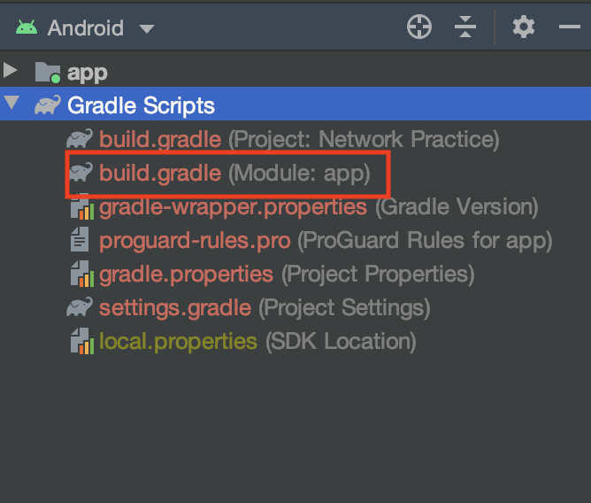
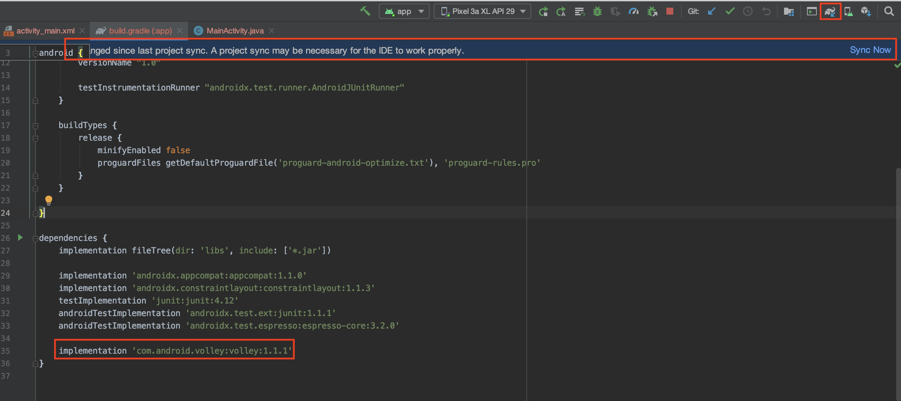
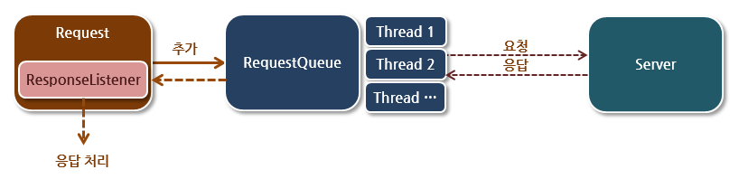
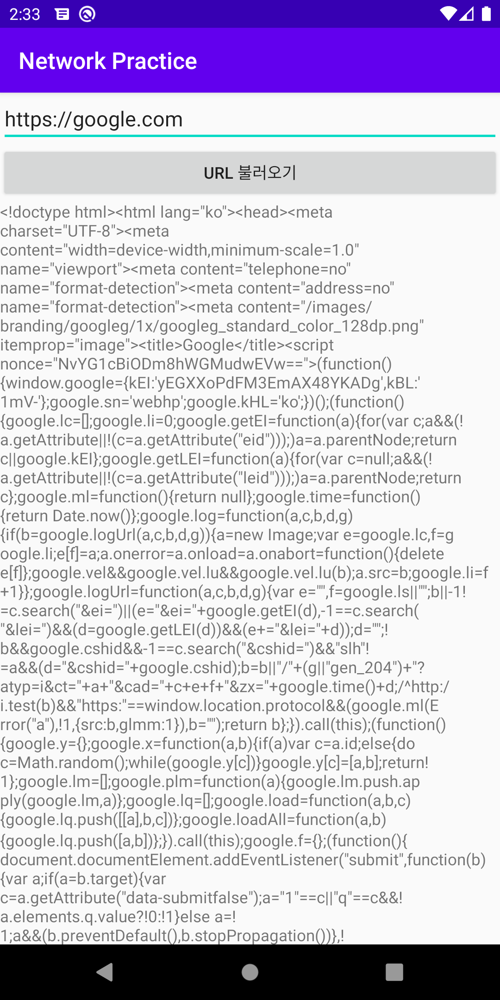

# 안드로이드 - REST API 스터디 5주차
어느덧 스터디의 절반이 지났습니다. 이번 주는 제가 많이 바빠서 스터디를 뺐는데 ㅠㅠ 자료도 늦게 올라가서 죄송합니다. 안드로이드의 마지막인데 이런식으로 온라인으로 대체하게 되네요.. 다음 주차부터는 백엔드로 넘어가보도록 합시다 ㅎㅎ

오늘은 우리 스터디의 안드로이드의 하이라이트인 네트워킹에 대해서 배워보도록 합시다! 우리가 사용하는 대부분의 앱은 서버와 통신하면서 인터넷을 이용합니다. 인터넷을 사용하지 않는 앱은 거의 없죠?? 우리의 스터디도 결국에는 서버를 만들어서 통신하도록 해야하므로.. 한번 배워보도록 합시다.

일단 프로젝트를 시작합시다. App의 이름은 **Thread AsyncTask**로 하고, 디렉토리의 이름은 **04_thread_asynctask**로 해주죠!

## Thread와 AsyncTask
thread와 async programming에 대해서는 저번 시간에 많이 얘기했죠? 기억이 안나신다면 [week 03을 참고하세요!](../week03/README.md)

### Thread
보통 네트워킹의 경우 시간이 오래 걸리기 때문에, thread를 사용해서 Mainthread가 멈추는 일이 없도록 해주어야 합니다. UI가 멈추면 안되겠죠? 그리고 여러가지 일을 한번에 처리할 때도 thread가 유용합니다. 다음과 같이 thread를 만들어봅시다.

```java
/* MainActivity.java */

public class MainActivity extends AppCompatActivity {

    @Override
    protected void onCreate(Bundle savedInstanceState) {
        super.onCreate(savedInstanceState);
        setContentView(R.layout.activity_main);

        Thread thread = new ValueThread();
        thread.start();
    }

    class ValueThread extends Thread {
        int value = 0;
        boolean running = false;

        @Override
        public void run() {
            running = true;

            while (running) {
                value += 1;
                try {
                    sleep(1000);
                } catch (InterruptedException e) {
                    e.printStackTrace();
                }
            }
        }
    }
}
```

이와 같이 Java에서는 `Thread` class를 상속받은 후, `run()` class를 override하여 thread를 구현합니다. 그리고 `valueThread.start()`와 같이 `start()`함수를 호출하여 thread를 시작하게 되죠. 정말 쉽죠?

#### Thread에서 UI 바꾸기
하지만 여기에는 함정이 하나 숨어있습니다. 그건 바로 UI를 바꿀 때 발생하는 것인데요. 예를 들어서, thread 안에서 다음과 같이 TextView의 내용물을 바꾸려고 하면 오류가 발생합니다.

```java
/* MainActivity.java */

public class MainActivity extends AppCompatActivity {

    TextView progressTextView;

    @Override
    protected void onCreate(Bundle savedInstanceState) {
        super.onCreate(savedInstanceState);
        setContentView(R.layout.activity_main);

        progressTextView = findViewById(R.id.progressTextView);

        Thread thread = new ValueThread();
        thread.start();
    }

    class ValueThread extends Thread {
        int value = 0;
        boolean running = false;

        @Override
        public void run() {
            running = true;

            while (running) {
                value += 1;
                
                progressTextView.setText(Integer.toString(value));
            }
        }
    }
}
```

위 코드를 실행시켜보면, 앱이 정상적으로 실행되지 않는 것을 확인할 수 있습니다. 이는 안드로이드의 구조상 UI요소돌은 모두 메인스레드에서 다루도록 되어 있기 때문입니다. 앱이 돌아가면서 여러가지 thread가 생성되는데, 이 thread가 모두 UI에 동시에 접근하게 되면 어떤 일이 발생할까요? 이런 상황을 **Race condition** 이라고 하는데, 이런 일을 방지하기 위해 위와 같이 메인스레드에서만 UI에 대해 접근할 수 있습니다.

따라서 여러분이 정의한 thread에서 UI에 접근하려면 handler라는 것을 이용해야 합니다.


위 그림과 같이, thread에서 handler를 통해 message를 전달하면 이 handler에서 메인 스레드를 통해 UI를 바꾸는 구조입니다.

백문이 불여일Run. 한번 코드를 보여드리도록 하죠!

```java
/* MainActivity */

public class MainActivity extends AppCompatActivity {

    TextView progressTextView;
    Handler valueHandler = new ValueHandler();

    @Override
    protected void onCreate(Bundle savedInstanceState) {
        super.onCreate(savedInstanceState);
        setContentView(R.layout.activity_main);

        progressTextView = findViewById(R.id.progressTextView);

        Thread thread = new ValueThread();
        thread.start();
    }

    class ValueThread extends Thread {
        int value = 0;
        boolean running = false;

        @Override
        public void run() {
            running = true;

            while (running) {
                value += 1;

                // UI 변경은 main thread에서만
                Message msg = new Message();
                Bundle bundle = new Bundle();
                bundle.putInt("value", value);
                msg.setData(bundle);
                valueHandler.sendMessage(msg);

                try {
                    sleep(1000);
                } catch (InterruptedException e) {
                    e.printStackTrace();
                }
            }
        }
    }

    class ValueHandler extends Handler {
        @Override
        public void handleMessage(@NonNull Message msg) {
            super.handleMessage(msg);

            Bundle bundle =  msg.getData();
            int value = bundle.getInt("value", 0);
            progressTextView.setText(Integer.toString(value));
        }
    }
}
```

위와 같이, UI를 건드리기 위해서는 `Handler` class를 상속받는 새로운 class를 상속한 뒤, `handleMessage()`를 구현하여야 합니다. 이 때, message에는 Bundle을 이용하여 data를 주고받을 수 있습니다. intent에서 했던 것과 비슷하죠? 여러가지 변수를 주고받을 때는 위와 같이 `Bundle`이라는 class를 사용합니다.

그런데, 모든 변수 하나하나에 대해서 위와 같이 handler를 구현해주는 것은 여간 번거로운 일이 아닙니다. 이에 대한 해결책으로, 다음과 같이 코드를 단순화 할 수 있습니다!

```java
/* MainActivity.java */

public class MainActivity extends AppCompatActivity {

    Handler handler = new Handler();
    TextView progressTextView;
    Handler valueHandler = new ValueHandler();

    @Override
    protected void onCreate(Bundle savedInstanceState) {
        super.onCreate(savedInstanceState);
        setContentView(R.layout.activity_main);

        progressTextView = findViewById(R.id.progressTextView);

        Thread thread = new ValueThread();
        thread.start();
    }

    class ValueThread extends Thread {
        int value = 0;
        boolean running = false;

        @Override
        public void run() {
            running = true;

            while (running) {
                value += 1;

                // UI 변경은 main thread에서만

                // Handler 방식
                /*
                Message msg = new Message();
                Bundle bundle = new Bundle();
                bundle.putInt("value", value);
                msg.setData(bundle);
                valueHandler.sendMessage(msg);
                */

                // post 방식
                handler.post(new Runnable() {
                    @Override
                    public void run() {
                        progressTextView.setText(Integer.toString(value));
                    }
                });

                try {
                    sleep(1000);
                } catch (InterruptedException e) {
                    e.printStackTrace();
                }
            }
        }
    }

    class ValueHandler extends Handler {
        @Override
        public void handleMessage(@NonNull Message msg) {
            super.handleMessage(msg);

            Bundle bundle =  msg.getData();
            int value = bundle.getInt("value", 0);
            progressTextView.setText(Integer.toString(value));
        }
    }
}
```

`Handler`에 구현되어 있는 post라는 친구를 통해, 우리가 실행하고싶은 UI 관련된 코드를 `Runnable`에 넣어 main thread에 전달해줄 수 있습니다! 이렇게 하면 굳이 handler를 구현하지 않아도 되니 간편하죠?

코드를 잘 읽어보고, Thread에 대해서 완벽하게 이해하도록 합시다!!

### AsyncTask
안드로이드에서는 비동기식으로 일을 처리하는 데에 두 가지 방식이 있습니다. 하나는 앞서 말한 Java의 `Thread` class를 이용하는 방식이고, 다른 하나는 안드로이드에서 제공하는 `AsyncTask`라는 class를 이용하는 방법입니다. 이 두개의 차이점에 대해서는 후에 알아보도록 하고, 일단 `AsyncTask`에 대해서 배워보도록 합시다.

```java
/* MainActivity */

public class MainActivity extends AppCompatActivity {

    Handler handler = new Handler();
    TextView progressTextView;
    Handler valueHandler = new ValueHandler();

    @Override
    protected void onCreate(Bundle savedInstanceState) {
        super.onCreate(savedInstanceState);
        setContentView(R.layout.activity_main);

        progressTextView = findViewById(R.id.progressTextView);

        // AsyncTask
        ProgressTask progressTask = new ProgressTask();
        progressTask.execute("시작");
    }


    class ProgressTask extends AsyncTask<String, Integer, Integer> {

        int value = 0;

        @Override
        protected Integer doInBackground(String... strings) {
            while (value < 10) {
                value++;
                publishProgress(value);

                try {
                    Thread.sleep(1000);
                } catch (Exception e) {
                    e.printStackTrace();
                }
            }

            return value;
        }

        @Override
        protected void onProgressUpdate(Integer... values) {
            super.onProgressUpdate(values);

            progressTextView.setText(Integer.toString(value));
        }

        @Override
        protected void onPostExecute(Integer integer) {
            super.onPostExecute(integer);

            progressTextView.setText("완료");
        }
    }
}
```

`AsyncTask` class는 위와 같이 구현할 수 있습니다. 핵심은 당연히 세 개의 함수인데, 보지 못했던 것들이 보입니다.

일단 `AsyncTask<String, Integer, Integer>` 이렇게 된 부분이 있는데, 지금은 잘 모르셔도 됩니다. 궁금하신 분들은 java의 class generic을 찾아보시면 됩니다.만.. 이해하기 쉽지 않을테니, 그냥 그렇구나 하고 넘어가시면 될 것 같습니다. 앞에서부터 각각 `doInBackground()`, `onProgressUpdate()`, `onPostExecute()`, 의 parameter의 type을 넣어주면 됩니다. 예를 들어 `doInBackground()`의 parameter가 Integer type이면.. `AsyncTask<Integer, Integer, Integer>` 이렇게요!

그리고 `String .. strings`와 같은 표현은, parameter의 길이가 동적으로 변할 수 있음을 의미합니다. 이러한 경우 `strings[0]`과 같이 parameter를 얻을 수 있고, `execute()`를 호출할 시 `execute(string1, string2, string3)` 이런 식으로 호출할 수 있습니다.

각각의 override해야 할 함수에 대해서는 다음과 같습니다.

1. `doInBackground()`: `AsyncTask`의 메인 함수로, 우리가 처리하고 싶은 일을 넣어주면 됩니다. parameter는 `execute()`로 전달받는 것과 같고, 결과값이 `onPostExecute()`의 parameter로 들어가게 됩니다. 따라서 `doInBackground()`의 결과값과 `onPostExecute()`의 parameter의 type이 같아야겠죠?
2. `onProgressUpdate()`: `publishProgress()`를 통해 전달된 값을 이용하여 중간중간 업데이트를 할 수 있습니다.
3. `onPostExecute()`: `doInBackground()`가 끝난 뒤의 결과값을 받아 background task가 끝날 때의 동작을 정의합니다.

`AsyncTask`는 `Thread`와는 다르게 각 함수 안에서 UI요소에 접근할 수가 있죠? 처음에는 난해하지만, 이해하고 나면 정말 편리하답니다!

### Thread vs AsyncTask
그렇다면 `Thread`와 `AsyncTask` 둘 중에서 어떤 것을 써야할까요?

보통 long running task이고 CPU를 많이 사용하는 task의 경우 `Thread`를, 가벼운 networking에 대한 경우 `AsyncTask`를 사용합니다. 두 개의 퍼포먼스 차이가 있기 때문인데, 우리가 만드는 앱의 경우 모두 `AsyncTask`로 처리해도 무방하기는 합니다 ㅎㅎ


## Network
이제부터 본격적으로 인터넷 통신에 대해서 배워보도록 하죠! 그 전에, network에 관련된 기본적인 지식을 알아보도록 합시다.

### HTTP
HTTP란 HyperText Transfer Protocol의 약자로, 웹 페이지 통신을 위해 만들어진 프로토콜입니다. 기본적으로는 html을 주고받기 위해 만들어진 프로토콜이지만, 근래에는 앱과 서버의 통신 등 여러 곳에서 사용되고 있습니다. 간단하게 표현하면 아래 그림과 같습니다!


HTTP message는 크게 header와 body로 이루어져 있습니다. header의 경우 통신에 필요한 부가적인 정보(meta info)가 들어 있고, body의 경우 당연히 내용물이 들어있게 되겠죠?

request의 경우 다음과 같이 구성됩니다.

1. URL
2. method
   - GET: html 페이지를 얻어오기 위한 method
   - POST: 서버에 데이터를 전달하기 위한 method
   - DELETE
   - PUT
   - PATCH
   - etc.

즉, 예를 들어 google 페이지를 요청하기 위해서는 `GET https://google.com` 이런 식이 되는 것이죠! 물론 message가 저렇게 생긴 것은 아니지만, 대략적으로 그렇다고 생각하면 될 것 같습니다.

### REST API
REST는 REpresentational State Transfer의 줄임말입니다. API는 Application Programming Interface의 줄임말로, 프로그램이 서로 통신할 때 약속하는 방식이라고 생각하시면 됩니다. HTTP를 이용한 REST API는 주로 GET, POST, PATCH, PUT, DELETE의 method와 URL을 통해 서버와 통신하도록 규정합니다. 다음과 같은 예가 있다고 생각해봅시다.

1. 서버에는 게시글이 저장되어 있음
2. 게시글을 조회, 게시, 수정할 수 있는 API가 필요함

위와 같은 상황에서, 다음과 같은 API가 있다고 생각해봅시다! `method URL`순으로 써져있다고 생각해보세요

- `GET /post`: 모든 게시글을 나열함
- `GET /post/{id}`: 게시글 하나를 조회함
- `POST /post`: 게시글을 올림
- `PATCH /post/{id}`: 게시글을 수정함

위의 API를 보면 어느정도 이해가 가시죠? REST API는 위와 같이 구성됩니다.

### JSON
그러면 REST API를 이용하여 서버와 통신할 때, 정보를 어떤 형태로 주고받을 지도 중요하겠죠?

HTTP에서는 JSON이라는 data type을 통해 정보를 교환합니다.

JSON은 key-value 쌍으로 이루어진 자료형으로, python의 dict 자료형과 비슷하다고 생각하시면 됩니다. 예를 들면 다음과 같이 되어있죠!

```json
{
    "userId": 1,
    "id": 1,
    "title": "sunt aut facere repellat provident occaecati excepturi optio reprehenderit",
    "body": "quia et suscipit\nsuscipit recusandae consequuntur expedita et cum\nreprehenderit molestiae ut ut quas totam\nnostrum rerum est autem sunt rem eveniet architecto"
}
```

이러한 json이 있을 때, `{key}: {value}`와 같은 형식으로 되어있는 것을 확인할 수 있습니다. python의 dict라고 생각하시면 정말 편해요! 아니면 java의 hashmap..이지만 조금 다르긴 하죠?

### 안드로이드에서 HTTP 통신
그러면, 본격적으로 안드로이드에서의 HTTP통신에 대해 알아보도록 합시다!

네트워크 통신은 기본적으로 CPU를 사용하는 task에 비해 **매우 느립니다.** 따라서 네트워크를 사용하는 동안 앱이 멈춰서는 안되니, 관련 task는 모두 async하게 처리해야겠죠?(thread를 만들거나, `AsyncTask`를 이용하거나)

하지만 우리가 지금부터 사용할 것은 미리 만들어진 **라이브러리**로, 해당 기능들을 모두 구현해놓은 상태입니다(이럴거면 왜 배웠나..). 우리는 volley라는 라이브러리를 사용해 보도록 합시다!

새로운 프로젝트를 만들도록 하죠. App 이름은 Network Practice로, directory는 04_network_project로요!

#### permission
안드로이드에서 인터넷을 사용하려면, permission을 설정해줘야 합니다. menifest파일을 열어 다음과 같이 `<uses-permission android:name="android.permission.INTERNET" />`를 추가해줍시다.

```xml
<!-- AndroidMenifests.xml -->

<?xml version="1.0" encoding="utf-8"?>
<manifest xmlns:android="http://schemas.android.com/apk/res/android"
    package="com.example.networkpractice">

    <uses-permission android:name="android.permission.INTERNET" />

    <application
        android:allowBackup="true"
        android:icon="@mipmap/ic_launcher"
        android:label="@string/app_name"
        android:roundIcon="@mipmap/ic_launcher_round"
        android:supportsRtl="true"
        android:theme="@style/AppTheme">
        <activity android:name=".MainActivity">
            <intent-filter>
                <action android:name="android.intent.action.MAIN" />

                <category android:name="android.intent.category.LAUNCHER" />
            </intent-filter>
        </activity>
    </application>

</manifest>
```

그러면 인터넷을 사용할 준비를 마친 것입니다!

#### volley 추가하기!
volley은 http 통신을 위해 만들어진 라이브러리로, 라이브러리를 사용할 때는 android studio에 dependency를 추가해줘야 합니다. 저번 시간에 이것때문에 애를 먹었죠? 죄송합니다.. 이번에는 제대로 추가하는 법을 배워봅시다!



위 그림과 같이, 프로젝트 directory에서 build.gradle(Module: app)을 열어준 뒤, 다음과 같이 `dependencies`에 `implementation 'com.android.volley:volley:1.1.1'` 이렇게 추가해주도록 합시다!



빨간 상자를 주목해줍시다. 이렇게 dependency를 추가해주면, 상단에 project sync 바가 나올텐데, `Sync Now`를 클릭해줍시다! 저것이 뜨지 않으면 저 위에 있는 작은 코끼리 모양을 눌러주세요! 잠시 후 빌드가 끝나면 라이브러리를 성공적으로 추가한 것이 됩니다.

#### volley를 통해 google 페이지 불러오기!
다음과 같이 main activity를 구성해줍시다.

```xml
<!-- activity_main.xml -->

<?xml version="1.0" encoding="utf-8"?>
<LinearLayout xmlns:android="http://schemas.android.com/apk/res/android"
    xmlns:app="http://schemas.android.com/apk/res-auto"
    xmlns:tools="http://schemas.android.com/tools"
    android:layout_width="match_parent"
    android:layout_height="match_parent"
    android:orientation="vertical"
    tools:context=".MainActivity" >

    <EditText
        android:id="@+id/urlText"
        android:layout_width="match_parent"
        android:layout_height="wrap_content"
        android:ems="10"
        android:inputType="textUri"
        android:text="URL을 입력해주세요" />

    <Button
        android:id="@+id/fetchButton"
        android:layout_width="match_parent"
        android:layout_height="wrap_content"
        android:text="url 불러오기" />

    <ScrollView
        android:layout_width="match_parent"
        android:layout_height="match_parent">

        <LinearLayout
            android:layout_width="match_parent"
            android:layout_height="wrap_content"
            android:orientation="vertical" >

            <TextView
                android:id="@+id/contentView"
                android:layout_width="match_parent"
                android:layout_height="wrap_content"
                android:text="내용이 올 곳입니다" />
        </LinearLayout>
    </ScrollView>
</LinearLayout>
```

그리고, java코드는 다음과 같이 해줍시다.

```java
/* MainActivity.java */

public class MainActivity extends AppCompatActivity {
    String TAG = MainActivity.class.getSimpleName();
    EditText urlText;
    TextView contentView;

    @Override
    protected void onCreate(Bundle savedInstanceState) {
        super.onCreate(savedInstanceState);
        setContentView(R.layout.activity_main);

        urlText = findViewById(R.id.urlText);
        contentView = findViewById(R.id.contentView);

        Button fetchButton = findViewById(R.id.fetchButton);
        fetchButton.setOnClickListener(new View.OnClickListener() {
            @Override
            public void onClick(View v) {
                String url = urlText.getText().toString();
                RequestQueue requestQueue = Volley.newRequestQueue(getApplicationContext());

                StringRequest request = new StringRequest(
                        Request.Method.GET,
                        url,
                        new Response.Listener<String>() {
                            @Override
                            public void onResponse(String response) {
                                contentView.setText(response);
                            }
                        },
                        new Response.ErrorListener() {
                            @Override
                            public void onErrorResponse(VolleyError error) {
                                Log.d(TAG, "onErrorResponse: " + error.getMessage());
                            }
                        }
                );
                requestQueue.add(request);
            }
        });
    }
}
```

차근차근 설명해드리도록 하죠!



우리는 네트워킹을 위해 thread를 이용해야 한다고 말했습니다. 하지만 volley는 그것을 자동으로 해줍니다! 정말 좋죠? 위 그림과 같이, volley에서는 `RequestQueue`라는 대기열을 만들어 그곳에 우리가 만든 request를 등록해주면, 알아서 thread를 관리해줍니다. 그 request에는 우리가 response를 어떻게 처리할 지 다루는 listener를 달아주면 되는거죠! 간단하죠?

따라서 다음과 같이 새로운 request queue를 만들어줍니다. 이때, 원래는 request queue가 여러번 만들어지지 않기 위해서 static class를 사용하는데, 저는 귀찮으니 그냥 만들도록 하겠습니다.

```java
RequestQueue requestQueue = Volley.newRequestQueue(getApplicationContext());
```

새로운 request를 만들어줍니다.

```java
StringRequest request = new StringRequest(
        Request.Method.GET,
        url,
        new Response.Listener<String>() {
            @Override
            public void onResponse(String response) {
                contentView.setText(response);
            }
        },
        new Response.ErrorListener() {
            @Override
            public void onErrorResponse(VolleyError error) {
                Log.d(TAG, "onErrorResponse: " + error.getMessage());
            }
        }
);
```

이때 method는 GET이고, url을 넘겨주면서, 세번째 네번째 parameter는 각각 성공시의 response listener, 실패시의 error listenr입니다. 우리는 일단 String object를 다루기 때문에 `StringRequest`를 사용했습니다.

```java
requestQueue.add(request);
```

이제 request를 위와 같이 등록해주면 요청이 처리됩니다!

이제 코드를 실행시켜보면 다음과 같이 url을 입력해서 내용을 얻을 수 있습니다!



저 이상한 텍스트는 뭐냐고요? 바로 google 페이지의 html 소스코드입니다!! 우리는 성공적으로 웹사이트와 통신할 수 있었습니다 ㅎㅎ

#### volley를 통해 REST API와 통신하기!
다음 사이트는 예시로 REST API를 제공해줍니다.

> [https://jsonplaceholder.typicode.com/](https://jsonplaceholder.typicode.com/)

들어가서 한번 둘러보세요! 예를 들어, [이 URL](https://jsonplaceholder.typicode.com/users)을 들어가보면 예시 자료가 다음과 같이 나옵니다.

```json
[
  {
    "id": 1,
    "name": "Leanne Graham",
    "username": "Bret",
    "email": "Sincere@april.biz",
    "address": {
      "street": "Kulas Light",
      "suite": "Apt. 556",
      "city": "Gwenborough",
      "zipcode": "92998-3874",
      "geo": {
        "lat": "-37.3159",
        "lng": "81.1496"
      }
    },
    "phone": "1-770-736-8031 x56442",
    "website": "hildegard.org",
    "company": {
      "name": "Romaguera-Crona",
      "catchPhrase": "Multi-layered client-server neural-net",
      "bs": "harness real-time e-markets"
    }
  },
  {
    "id": 2,
    "name": "Ervin Howell",
    "username": "Antonette",
    "email": "Shanna@melissa.tv",
    "address": {
      "street": "Victor Plains",
      "suite": "Suite 879",
      "city": "Wisokyburgh",
      "zipcode": "90566-7771",
      "geo": {
        "lat": "-43.9509",
        "lng": "-34.4618"
      }
    },
    "phone": "010-692-6593 x09125",
    "website": "anastasia.net",
    "company": {
      "name": "Deckow-Crist",
      "catchPhrase": "Proactive didactic contingency",
      "bs": "synergize scalable supply-chains"
    }
  }
]
```

우리는 위 user의 정보를 받아서 화면에 이름을 출력해보도록 합시다.

```java
/* MainActivity.java */

public class MainActivity extends AppCompatActivity {
    String TAG = MainActivity.class.getSimpleName();
    EditText urlText;
    TextView contentView;

    @Override
    protected void onCreate(Bundle savedInstanceState) {
        super.onCreate(savedInstanceState);
        setContentView(R.layout.activity_main);

        urlText = findViewById(R.id.urlText);
        contentView = findViewById(R.id.contentView);

        Button fetchButton = findViewById(R.id.fetchButton);
        fetchButton.setOnClickListener(new View.OnClickListener() {
            @Override
            public void onClick(View v) {
                // 웹 페이지 불러오기
                /*
                String url = urlText.getText().toString();
                RequestQueue requestQueue = Volley.newRequestQueue(getApplicationContext());

                StringRequest request = new StringRequest(
                        Request.Method.GET,
                        url,
                        new Response.Listener<String>() {
                            @Override
                            public void onResponse(String response) {
                                contentView.setText(response);
                            }
                        },
                        new Response.ErrorListener() {
                            @Override
                            public void onErrorResponse(VolleyError error) {
                                Log.d(TAG, "onErrorResponse: " + error.getMessage());
                            }
                        }
                );
                requestQueue.add(request);
                */

                // REST API 불러오기
                String url = "https://jsonplaceholder.typicode.com/users";
                RequestQueue requestQueue = Volley.newRequestQueue(getApplicationContext());

                JsonArrayRequest request = new JsonArrayRequest(
                        Request.Method.GET,
                        url,
                        null,
                        new Response.Listener<JSONArray>() {
                            @Override
                            public void onResponse(JSONArray response) {
                                contentView.setText("");
                                for (int i = 0; i < response.length(); i++) {
                                    try {
                                        JSONObject object = (JSONObject) response.get(i);
                                        contentView.append(object.getString("name") + "\n\n");
                                    } catch (JSONException e) {
                                        Log.d(TAG, "onResponse: " + e.getMessage());
                                    }
                                }
                            }
                        },
                        new Response.ErrorListener() {
                            @Override
                            public void onErrorResponse(VolleyError error) {
                                Log.d(TAG, "onErrorResponse: " + error.getMessage());
                            }
                        }
                );
                requestQueue.add(request);
            }
        });
    }
}
```

위와 같이 코드를 바꿔보도록 할까요? 바뀐 점은 다음과 같습니다.

1. `StringRequest`에서 `JsonArrayRequest`로 바뀜
2. 이에따라 바뀌는 type들
3. JSON response를 처리하기 위한 for loop

코드를 읽어보면 크게 어려운 점은 없을 겁니다. try catch의 경우 exception을 처리하기 위해 넣어준 것으로, 앱이 멈추지 않도록 도와줍니다. 지금은 큰 의미 안가지고 넘어가도 됩니다!

이렇게 우리는 REST API와 통신해보는 실습까지 마쳤습니다! 원하는 message를 받아서 처리할 수 있겠죠?

## 마치며
자 오늘도 많은 것을 배웠죠.. 네트워킹을 끝으로 안드로이드 스터디는 마무리를 하고, 다음 시간부터는 서버를 배워보도록 합시다.

너무 빠르게 배워서 아직 많이 헷갈리실텐데, 복습을 많이 하셔야될 것 같습니다 ㅎㅎ.. 이해 안되는 거 있으시면 언제든 말씀해주시고요!