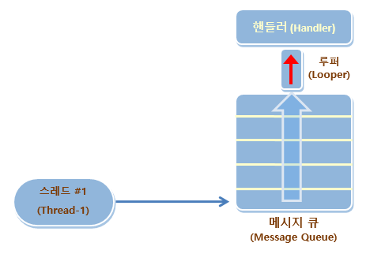

# 안드로이드 - REST API 스터디 5주차
어느덧 스터디의 절반이 지났습니다. 이번 주는 제가 많이 바빠서 스터디를 뺐는데 ㅠㅠ 자료도 늦게 올라가서 죄송합니다. 안드로이드의 마지막인데 이런식으로 온라인으로 대체하게 되네요.. 다음 주차부터는 백엔드로 넘어가보도록 합시다 ㅎㅎ

오늘은 우리 스터디의 안드로이드의 하이라이트인 네트워킹에 대해서 배워보도록 합시다! 우리가 사용하는 대부분의 앱은 서버와 통신하면서 인터넷을 이용합니다. 인터넷을 사용하지 않는 앱은 거의 없죠?? 우리의 스터디도 결국에는 서버를 만들어서 통신하도록 해야하므로.. 한번 배워보도록 합시다.

일단 프로젝트를 시작합시다. App의 이름은 **Thread AsyncTask**로 하고, 디렉토리의 이름은 **04_thread_asynctask**로 해주죠!

## Thread와 AsyncTask
thread와 async programming에 대해서는 저번 시간에 많이 얘기했죠? 기억이 안나신다면 [week 03을 참고하세요!](../week03/README.md)

### Thread
보통 네트워킹의 경우 시간이 오래 걸리기 때문에, thread를 사용해서 Mainthread가 멈추는 일이 없도록 해주어야 합니다. UI가 멈추면 안되겠죠? 그리고 여러가지 일을 한번에 처리할 때도 thread가 유용합니다. 다음과 같이 thread를 만들어봅시다.

```java
/* MainActivity.java */

public class MainActivity extends AppCompatActivity {

    @Override
    protected void onCreate(Bundle savedInstanceState) {
        super.onCreate(savedInstanceState);
        setContentView(R.layout.activity_main);

        Thread thread = new ValueThread();
        thread.start();
    }

    class ValueThread extends Thread {
        int value = 0;
        boolean running = false;

        @Override
        public void run() {
            running = true;

            while (running) {
                value += 1;
                try {
                    sleep(1000);
                } catch (InterruptedException e) {
                    e.printStackTrace();
                }
            }
        }
    }
}
```

이와 같이 Java에서는 `Thread` class를 상속받은 후, `run()` class를 override하여 thread를 구현합니다. 그리고 `valueThread.start()`와 같이 `start()`함수를 호출하여 thread를 시작하게 되죠. 정말 쉽죠?

#### Thread에서 UI 바꾸기
하지만 여기에는 함정이 하나 숨어있습니다. 그건 바로 UI를 바꿀 때 발생하는 것인데요. 예를 들어서, thread 안에서 다음과 같이 TextView의 내용물을 바꾸려고 하면 오류가 발생합니다.

```java
/* MainActivity.java */

public class MainActivity extends AppCompatActivity {

    TextView progressTextView;

    @Override
    protected void onCreate(Bundle savedInstanceState) {
        super.onCreate(savedInstanceState);
        setContentView(R.layout.activity_main);

        progressTextView = findViewById(R.id.progressTextView);

        Thread thread = new ValueThread();
        thread.start();
    }

    class ValueThread extends Thread {
        int value = 0;
        boolean running = false;

        @Override
        public void run() {
            running = true;

            while (running) {
                value += 1;
                
                progressTextView.setText(Integer.toString(value));
            }
        }
    }
}
```

위 코드를 실행시켜보면, 앱이 정상적으로 실행되지 않는 것을 확인할 수 있습니다. 이는 안드로이드의 구조상 UI요소돌은 모두 메인스레드에서 다루도록 되어 있기 때문입니다. 앱이 돌아가면서 여러가지 thread가 생성되는데, 이 thread가 모두 UI에 동시에 접근하게 되면 어떤 일이 발생할까요? 이런 상황을 **Race condition** 이라고 하는데, 이런 일을 방지하기 위해 위와 같이 메인스레드에서만 UI에 대해 접근할 수 있습니다.

따라서 여러분이 정의한 thread에서 UI에 접근하려면 handler라는 것을 이용해야 합니다.



위 그림과 같이, thread에서 handler를 통해 message를 전달하면 이 handler에서 메인 스레드를 통해 UI를 바꾸는 구조입니다.

백문이 불여일Run. 한번 코드를 보여드리도록 하죠!

```java
/* MainActivity */

public class MainActivity extends AppCompatActivity {

    TextView progressTextView;
    Handler valueHandler = new ValueHandler();

    @Override
    protected void onCreate(Bundle savedInstanceState) {
        super.onCreate(savedInstanceState);
        setContentView(R.layout.activity_main);

        progressTextView = findViewById(R.id.progressTextView);

        Thread thread = new ValueThread();
        thread.start();
    }

    class ValueThread extends Thread {
        int value = 0;
        boolean running = false;

        @Override
        public void run() {
            running = true;

            while (running) {
                value += 1;

                // UI 변경은 main thread에서만
                Message msg = new Message();
                Bundle bundle = new Bundle();
                bundle.putInt("value", value);
                msg.setData(bundle);
                valueHandler.sendMessage(msg);

                try {
                    sleep(1000);
                } catch (InterruptedException e) {
                    e.printStackTrace();
                }
            }
        }
    }

    class ValueHandler extends Handler {
        @Override
        public void handleMessage(@NonNull Message msg) {
            super.handleMessage(msg);

            Bundle bundle =  msg.getData();
            int value = bundle.getInt("value", 0);
            progressTextView.setText(Integer.toString(value));
        }
    }
}
```

위와 같이, UI를 건드리기 위해서는 `Handler` class를 상속받는 새로운 class를 상속한 뒤, `handleMessage()`를 구현하여야 합니다. 이 때, message에는 Bundle을 이용하여 data를 주고받을 수 있습니다. intent에서 했던 것과 비슷하죠? 여러가지 변수를 주고받을 때는 위와 같이 `Bundle`이라는 class를 사용합니다.

그런데, 모든 변수 하나하나에 대해서 위와 같이 handler를 구현해주는 것은 여간 번거로운 일이 아닙니다. 이에 대한 해결책으로, 다음과 같이 코드를 단순화 할 수 있습니다!

```java
/* MainActivity.java */

public class MainActivity extends AppCompatActivity {

    Handler handler = new Handler();
    TextView progressTextView;
    Handler valueHandler = new ValueHandler();

    @Override
    protected void onCreate(Bundle savedInstanceState) {
        super.onCreate(savedInstanceState);
        setContentView(R.layout.activity_main);

        progressTextView = findViewById(R.id.progressTextView);

        Thread thread = new ValueThread();
        thread.start();
    }

    class ValueThread extends Thread {
        int value = 0;
        boolean running = false;

        @Override
        public void run() {
            running = true;

            while (running) {
                value += 1;

                // UI 변경은 main thread에서만

                // Handler 방식
                /*
                Message msg = new Message();
                Bundle bundle = new Bundle();
                bundle.putInt("value", value);
                msg.setData(bundle);
                valueHandler.sendMessage(msg);
                */

                // post 방식
                handler.post(new Runnable() {
                    @Override
                    public void run() {
                        progressTextView.setText(Integer.toString(value));
                    }
                });

                try {
                    sleep(1000);
                } catch (InterruptedException e) {
                    e.printStackTrace();
                }
            }
        }
    }

    class ValueHandler extends Handler {
        @Override
        public void handleMessage(@NonNull Message msg) {
            super.handleMessage(msg);

            Bundle bundle =  msg.getData();
            int value = bundle.getInt("value", 0);
            progressTextView.setText(Integer.toString(value));
        }
    }
}
```

`Handler`에 구현되어 있는 post라는 친구를 통해, 우리가 실행하고싶은 UI 관련된 코드를 `Runnable`에 넣어 main thread에 전달해줄 수 있습니다! 이렇게 하면 굳이 handler를 구현하지 않아도 되니 간편하죠?

코드를 잘 읽어보고, Thread에 대해서 완벽하게 이해하도록 합시다!!

### AsyncTask
안드로이드에서는 비동기식으로 일을 처리하는 데에 두 가지 방식이 있습니다. 하나는 앞서 말한 Java의 `Thread` class를 이용하는 방식이고, 다른 하나는 안드로이드에서 제공하는 `AsyncTask`라는 class를 이용하는 방법입니다. 이 두개의 차이점에 대해서는 후에 알아보도록 하고, 일단 `AsyncTask`에 대해서 배워보도록 합시다.

```java
/* MainActivity */

public class MainActivity extends AppCompatActivity {

    Handler handler = new Handler();
    TextView progressTextView;
    Handler valueHandler = new ValueHandler();

    @Override
    protected void onCreate(Bundle savedInstanceState) {
        super.onCreate(savedInstanceState);
        setContentView(R.layout.activity_main);

        progressTextView = findViewById(R.id.progressTextView);

        // AsyncTask
        ProgressTask progressTask = new ProgressTask();
        progressTask.execute("시작");
    }


    class ProgressTask extends AsyncTask<String, Integer, Integer> {

        int value = 0;

        @Override
        protected Integer doInBackground(String... strings) {
            while (value < 10) {
                value++;
                publishProgress(value);

                try {
                    Thread.sleep(1000);
                } catch (Exception e) {
                    e.printStackTrace();
                }
            }

            return value;
        }

        @Override
        protected void onProgressUpdate(Integer... values) {
            super.onProgressUpdate(values);

            progressTextView.setText(Integer.toString(value));
        }

        @Override
        protected void onPostExecute(Integer integer) {
            super.onPostExecute(integer);

            progressTextView.setText("완료");
        }
    }
}
```

`AsyncTask` class는 위와 같이 구현할 수 있습니다. 핵심은 당연히 세 개의 함수인데, 보지 못했던 것들이 보입니다.

일단 `AsyncTask<String, Integer, Integer>` 이렇게 된 부분이 있는데, 지금은 잘 모르셔도 됩니다. 궁금하신 분들은 java의 class generic을 찾아보시면 됩니다.만.. 이해하기 쉽지 않을테니, 그냥 그렇구나 하고 넘어가시면 될 것 같습니다. 앞에서부터 각각 `doInBackground()`, `onProgressUpdate()`, `onPostExecute()`, 의 parameter의 type을 넣어주면 됩니다. 예를 들어 `doInBackground()`의 parameter가 Integer type이면.. `AsyncTask<Integer, Integer, Integer>` 이렇게요!

그리고 `String .. strings`와 같은 표현은, parameter의 길이가 동적으로 변할 수 있음을 의미합니다. 이러한 경우 `strings[0]`과 같이 parameter를 얻을 수 있고, `execute()`를 호출할 시 `execute(string1, string2, string3)` 이런 식으로 호출할 수 있습니다.

각각의 override해야 할 함수에 대해서는 다음과 같습니다.

1. `doInBackground()`: `AsyncTask`의 메인 함수로, 우리가 처리하고 싶은 일을 넣어주면 됩니다. parameter는 `execute()`로 전달받는 것과 같고, 결과값이 `onPostExecute()`의 parameter로 들어가게 됩니다. 따라서 `doInBackground()`의 결과값과 `onPostExecute()`의 parameter의 type이 같아야겠죠?
2. `onProgressUpdate()`: `publishProgress()`를 통해 전달된 값을 이용하여 중간중간 업데이트를 할 수 있습니다.
3. `onPostExecute()`: `doInBackground()`가 끝난 뒤의 결과값을 받아 background task가 끝날 때의 동작을 정의합니다.

`AsyncTask`는 `Thread`와는 다르게 각 함수 안에서 UI요소에 접근할 수가 있죠? 처음에는 난해하지만, 이해하고 나면 정말 편리하답니다!

### Thread vs AsyncTask
그렇다면 `Thread`와 `AsyncTask` 둘 중에서 어떤 것을 써야할까요?

보통 long running task이고 CPU를 많이 사용하는 task의 경우 `Thread`를, 가벼운 networking에 대한 경우 `AsyncTask`를 사용합니다. 두 개의 퍼포먼스 차이가 있기 때문인데, 우리가 만드는 앱의 경우 모두 `AsyncTask`로 처리해도 무방하기는 합니다 ㅎㅎ
