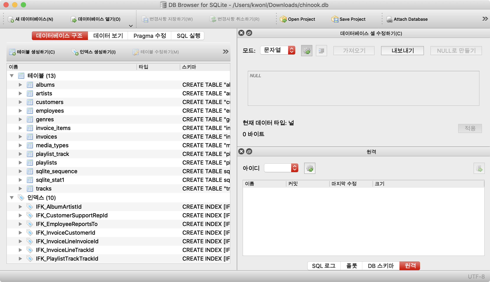
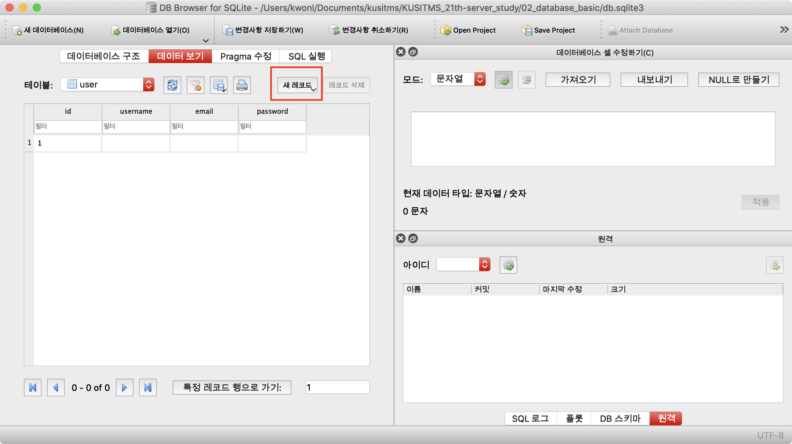

# 안드로이드 - REST API 스터디 7주차
오늘은 database와 flask에서의 ORM에 대해서 배워보도록 합시다! 각각 다음의 것들을 사용할 것입니다.

- DB: sqlite3
- ORM: flask-sqlalchemy

## Databse
서비스에 있어서 핵심적인 역할을 하는 것이 뭘까요? 바로 데이터입니다. 데이터가 중요해지는 세상에서..이러한 데이터를 효율적으로 관리할 수 있는 DB의 중요성은 날이 갈수록 커지고 있습니다. 따라서 우리는 데이터베이스를 공부해야겠죠? ㅎ

대표적인 DB로는 SQL 계열의 MySQL, PostgreSQL, Sqlite 등이 있고, NoSQL 계열의 mongoDB, documentDB 등이 있습니다. 우리는 SQL에서도 sqlite를 이용하여 수업을 하도록 합시다.

sqlite는 로컬 파일에 db를 저장하여 사용합니다. 아주 가벼운 프로젝트에서 사용하기 좋은 DB이죠! 하지만 서비스의 크기가 커지면 결국에는 MySQL이나 Postgresql을 사용해야 합니다만..

## Sqlite
### Sqlite 설치
다음의 링크를 통해 sqlite db를 GUI환경에서 볼 수 있는 client를 설치해봅시다.

> [https://sqlitebrowser.org/](https://sqlitebrowser.org/)

그리고 다음의 [파일](chinook.db)을 다운받아 봅시다.

프로그램을 실행시키고, 다운받은 chinook.db를 드래그해서 열거나 `데이터베이스 열기`를 통해서 DB를 열어봅시다! 다음의 화면이 나올 것입니다.



요즘에는 이러한 GUI 툴이 나와서 SQL 없이도 간단한 DB관리는 할 수 있습니다. 하지만 더 복잡하고 전문적인 관리를 위해서는 SQL을 배워야겠죠? 또한 cli 툴을 다룰 줄도 알아야 합니다. 그러니 서버 개발을 하고싶으시다면, 일단 cli에 익숙해지는 것을 추천드립니다.. 이 스터디에서는 최대한 피할 예정이긴 합니다.

`데이터 보기`를 클릭하여 우리의 샘플 DB를 탐색할 수 있습니다!! 둘러보면서 데이터를 보시죠.

### Table? Row?
Databse에서 데이터는 각자의 단위를 가지고 관리가 됩니다. 기본적으로는 엑셀과 유사하다고 생각하고, database에서의 기본적인 단위는 다음과 같이 이해하면 편합니다.

| SQL         | 엑셀       |
| ----------- | -------- |
| Databse     | 엑셀 파일 하나 |
| table       | 엑셀 시트    |
| record(row) | row      |
| column      | column   |

어려울 것 전혀 없죠? 이제 파일을 탐색하면서 감을 잡아보도록 합시다.

## ORM
ORM이란 Object-Relational Programming의 줄임말입니다. 우리가 사용하는 언어는 python인데, database는 SQL이라는 것을 사용하죠? 따라서 원래는 SQL로 데이터를 가져와서 이를 parsing(해석)하여 python에서 사용 가능하도록 바꿔줘야 합니다. 예를 들어보죠!

```sql
SELECT username, birth, nickname, gender FROM user_table WHERE id = 3;
```

python에서 위 SQL 구문으로 데이터를 가져온다고 하면, id가 3인 유저의 username, birth, nickname, gender가 list형태로 반환되게 됩니다. 예를 들면 `['이권형', '0116', '하케장', '남성']` 이렇게요! 이런거를 일일이 변수에 배정해주려면 상당히 빡치겠죠?

이를 방지하기 위해 SQL을 python의 class를 통해 쉽게 관리할 수 있도록 해주는 ORM이 개발되었습니다. django의 경우 ORM을 자체적으로 개발하고 있기 때문에 새로운 plugin을 붙일 필요가 없지만, flask는 자체적인 ORM이 없기 때문에 새로운 plugin을 붙여야 합니다.

바로 `flask-sqlalchemy`라는 것이죠! 원래 `SQLAlchemy`라는 프로젝트가 있는데, 이것을 flask에서 사용하기 쉽도록(session관리 등) 접목시킨 것이 `flask-sqlalchemy`입니다.

먼저, 새로운 프로젝트를 만들어줍시다. 프로젝트 이름은 적당히 하여서..그리고 저번 시간과 같이 flask를 설치해줍시다.

위 과정을 거친 뒤, 터미널을 열고, 다음 command를 입력하여 flask-sqlalchemy 설치해보도록 합시다.

```bash
# pip를 이용하면
pip install flask-sqlalchemy

# conda를 이용하면
conda install flask-sqlalchemy
```

### ORM 개념
ORM에서는 다음과 같이 model이라는 것을 정의하고, 이에 따라 database와 소통하게 됩니다. 다음 예시를 보시죠!

```python
class User(db.Model):
    id = db.Column(db.Integer, primary_key=True)
    username = db.Column(db.String(80), unique=True, nullable=False)
    email = db.Column(db.String(120), unique=True, nullable=False)
    password = db.Column(db.String(200), nullable=False)

    def __repr__(self):
        return '<User %r>' % self.username
```

이렇게 User라는 class를 정의하면, 이를 기반으로 db를 만들고 db와 소통하게 됩니다. 따라서 

| SQL         | 엑셀       | ORM                    |
| ----------- | -------- | ---------------------- |
| Databse     | 엑셀 파일 하나 | class의 모음              |
| table       | 엑셀 시트    | class (Model)          |
| record(row) | row      | class의 instance        |
| column      | column   | class의 member variable |

각각의 관계도가 이렇게 되겠죠?!

### Migration
이렇듯 class를 통해 우리의 model을 정의해줬으면, 이를 DB에 적용하는 과정이 필요합니다. 일단 flask-migrate 를 설치합시다.

```bash
# pip의 경우
pip install flask-migrate

# anaconda의 경우
conda install flask-migrate
```

프로젝트에서, 각각 app.py, databse.py를 만들어 다음과 같이 입력해줍시다.

```python
# app.py

from flask import Flask
from database import db
from flask_migrate import Migrate

app = Flask(__name__)
app.config["SQLALCHEMY_DATABASE_URI"] = "sqlite:///db.sqlite3"
db.init_app(app)
migrate = Migrate(app, db)
```

```python
# database.py

from flask_sqlalchemy import SQLAlchemy
db = SQLAlchemy()


class User(db.Model):
    id = db.Column(db.Integer, primary_key=True, autoincrement=True)
    username = db.Column(db.String(80), unique=True, nullable=False)
    email = db.Column(db.String(120), unique=True, nullable=False)
    password = db.Column(db.String(200), nullable=False)

    def __repr__(self):
        return '<User %r>' % self.username
```

다음의 command를 통해 migration을 초기화 해줍니다.

```bash
flask db init
```

위 command는 프로젝트를 만들고 처음에만 해주면 되고, 이후에는 model이 바뀔 때마다 아래의 command만 입력해주면 됩니다!

```bash
flask db migrate
flask db upgrade
```

이제 `db Browser`를 열어서, user table에 새로운 유저를 추가해줄까요!?



다음과 같은 그림에서 `새 레코드`버튼을 눌러주고, 새로 추가된 row에 대해서 정보를 채워줍시다. 이렇게 여러 유저를 추가해볼까요?

### ORM 사용하기
먼저, `templates/index.html`에 다음과 같이 코드를 추가해줍시다.

```html
<!--templates/index.html-->
<!DOCTYPE html>
<html>

<head>
    <meta charset="utf-8">
</head>

<body>
    
        <p>id: {{ user.id }}</p>
        <p>이름: {{ user.username }}</p>
        <p>이메일: {{ user.email }}</p>
    
</body>

</html>
```

`app.py`를 다음과 같이 바꿔줍시다.

```python
# app.py

from flask import Flask, render_template
from database import db, User
from flask_migrate import Migrate

app = Flask(__name__)
app.config["SQLALCHEMY_DATABASE_URI"] = "sqlite:///db.sqlite3"
db.init_app(app)
migrate = Migrate(app, db)


@app.route("/user")
def user_list():
    users = User.query.all()
    print(users)
    return "hello world!"


if __name__ == "__main__":
    app.run()
```

그리고 [http://127.0.0.1:5000/user](http://127.0.0.1:5000/user)에 들어가보면, 콘솔 창에 재밌는 정보가 뜨는 것을 확인할 수 있습니다! 위와 같이 `User.query`를 통해서 쿼리를 날리고, 그 결과를 통해 우리는 DB와 소통할 수 있습니다!

다음과 같이 코드를 추가해볼까요?

```html
<!--templates/detail.html-->
<!DOCTYPE html>
<html>

<head>
    <meta charset="utf-8">
</head>

<body>
    
        <p>id: {{ user.id }}</p>
        <p>이름: {{ user.username }}</p>
        <p>이메일: {{ user.email }}</p>
    
</body>

</html>
```

```python
# app.py

from flask import Flask, render_template
from database import db, User
from flask_migrate import Migrate

app = Flask(__name__)
app.config["SQLALCHEMY_DATABASE_URI"] = "sqlite:///db.sqlite3"
db.init_app(app)
migrate = Migrate(app, db)


@app.route("/user")
def user_list():
    users = User.query.all()
    return render_template("index.html", users=users)


@app.route("/user/<int:id>")
def user_detail(id):
    user = User.query.filter_by(id=id).first()
    return render_template("detail.html", user=user)


if __name__ == "__main__":
    app.run()
```

이렇 듯, User.query를 통해 여러가지 쿼리를 실행할 수 있습니다. 자세한 사항은 구글링을 통해..!!ㅋㅋㅋ

## 마치며
스터디 자료를 급하게 만드느라,, 내용이 부실한데 나중에 채워넣을 수 있으면 채워넣어 보겠습니다,,

오늘은 Database에 대해서 배워봤는데, 조금 어려울 수 있지만 익숙해지면 굉장히 편하게 다룰 수 있을 겁니다!

두 번 남았네요!! 남은 스터디도 화이팅!